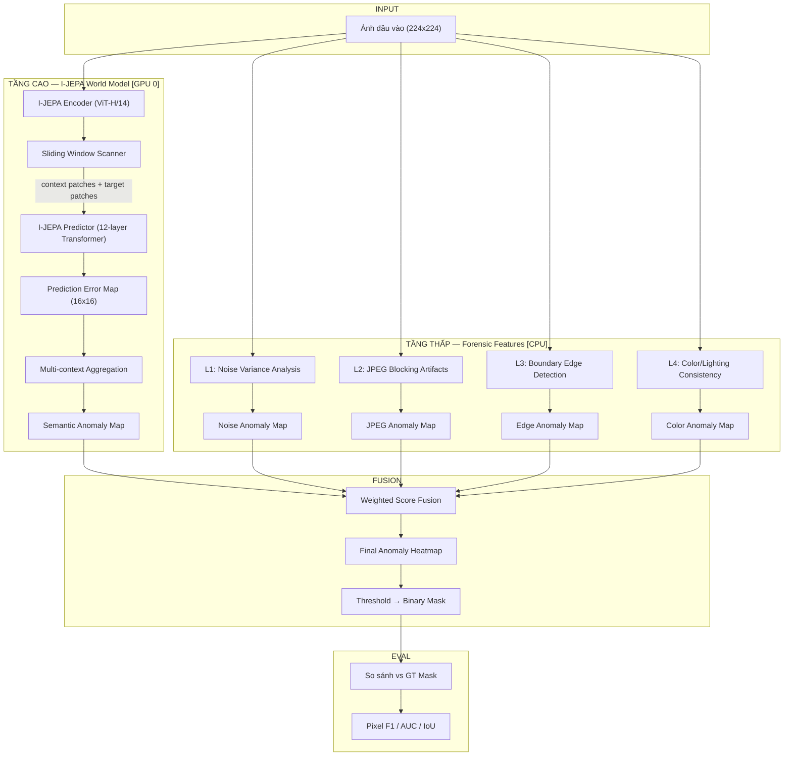

# Kế hoạch triển khai: 5-Layer Forensic Detection với I-JEPA World Model

## Tổng quan

Sử dụng I-JEPA World Model kết hợp forensic features để phát hiện vùng bị chỉnh sửa trong ảnh. Triển khai trên **GPU 0** (rảnh).

---

## Pipeline tổng thể



---

## Chi tiết từng tầng Forensic

### Tầng 5 (Cao nhất): I-JEPA Semantic Prediction Error

**Nguyên lý**: I-JEPA Predictor dự đoán representation của vùng target từ context. Nếu vùng bị ghép → prediction error cao.

**Cách hoạt động**:

```
Ảnh 224x224 → ViT-H/14 → 16x16 = 256 patch tokens (1280-dim)

Với mỗi patch (i,j):
  1. Context = tất cả patches NGOẠI TRỪ vùng 3x3 quanh (i,j)
  2. Target  = patch (i,j) + neighbors
  3. Predictor(context) → predicted_target
  4. Error(i,j) = 1 - cosine_similarity(predicted, actual)

→ Error Map 16x16 (upscale → 224x224)
```

**Multi-context**: Dự đoán mỗi patch từ 4 context khác nhau (trái, phải, trên, dưới) → lấy variance → vùng ghép cho variance cao.

### Tầng 4: Color/Lighting Consistency

**Nguyên lý**: Vùng ghép từ ảnh khác thường có white balance, histogram màu, hướng ánh sáng khác.

```python
# Chia ảnh thành grid 8x8 blocks
# Với mỗi block: tính color histogram (HSV space)
# So sánh histogram mỗi block với neighbors
# Block lệch nhiều = nghi vấn
```

### Tầng 3: Boundary Edge Detection

**Nguyên lý**: Biên giới vùng ghép có edge artifacts (discontinuity bất thường).

```python
# Sobel edge detection → edge map
# Tính edge density per region
# Vùng có edge density đột biến = biên giới ghép
```

### Tầng 2: JPEG Compression Artifacts

**Nguyên lý**: Vùng ghép bị nén JPEG 2 lần → blocking artifacts khác biệt.

```python
# Phân tích DCT coefficients tại biên block 8x8
# Tính blocking artifact strength per region
# Vùng có artifact strength khác biệt = double compression
```

### Tầng 1: Noise/Texture Consistency

**Nguyên lý**: Camera noise pattern (grain, ISO) khác nhau giữa vùng gốc và vùng ghép.

```python
# High-pass filter → tách noise residual
# Tính local noise variance (sliding window 32x32)
# Vùng có variance khác biệt với global = nghi vấn
```

---

## Cấu trúc code

```
ijepa/
├── scripts/
│   ├── ijepa_inference_test.py          # (Có sẵn) Inference cơ bản
│   ├── forensic_detector.py             # [MỚI] 5-layer forensic detector
│   └── evaluate_casia.py                # [MỚI] Evaluation trên CASIA 2.0
├── src/
│   └── forensics/                       # [MỚI] Module forensic
│       ├── __init__.py
│       ├── noise_analysis.py            # L1: Noise variance
│       ├── jpeg_analysis.py             # L2: JPEG artifacts
│       ├── edge_analysis.py             # L3: Boundary detection
│       ├── color_analysis.py            # L4: Color consistency
│       └── fusion.py                    # Score fusion
└── docs/
    └── sub_semantic_detection_analysis.md # (Có sẵn) Phân tích
```

### File 1: `src/forensics/noise_analysis.py` — Tầng 1

```python
"""Noise Variance Analysis — phát hiện camera noise mismatch."""
import cv2
import numpy as np

def detect_noise_inconsistency(image_np, window_size=32):
    """
    Tách noise residual bằng high-pass filter, tính local variance.
    Vùng có noise variance khác biệt = nghi vấn.
    
    Args:
        image_np: numpy array [H, W, 3] (uint8)
        window_size: kích thước cửa sổ tính variance
    Returns:
        anomaly_map: [H, W] float, giá trị cao = nghi vấn
    """
    gray = cv2.cvtColor(image_np, cv2.COLOR_RGB2GRAY).astype(np.float64)
    
    # High-pass filter: tách noise
    blur = cv2.GaussianBlur(gray, (5, 5), 0)
    noise = gray - blur
    
    # Local variance (efficient via integral image)
    noise_sq = noise ** 2
    kernel = np.ones((window_size, window_size)) / (window_size ** 2)
    local_mean = cv2.filter2D(noise, -1, kernel)
    local_var = cv2.filter2D(noise_sq, -1, kernel) - local_mean ** 2
    local_var = np.maximum(local_var, 0)
    
    # Anomaly = deviation from global
    global_var = np.median(local_var)  # Dùng median (robust hơn mean)
    anomaly = np.abs(local_var - global_var) / (global_var + 1e-8)
    
    return anomaly
```

### File 2: `src/forensics/jpeg_analysis.py` — Tầng 2

```python
"""JPEG Blocking Artifacts Analysis — phát hiện double compression."""
import cv2
import numpy as np

def detect_jpeg_artifacts(image_np, block_size=8):
    """
    Phân tích blocking artifacts tại biên block 8x8 JPEG.
    Vùng có blocking artifact strength khác biệt = double compressed.
    
    Args:
        image_np: numpy array [H, W, 3] (uint8)
    Returns:
        anomaly_map: [H, W] float
    """
    gray = cv2.cvtColor(image_np, cv2.COLOR_RGB2GRAY).astype(np.float64)
    h, w = gray.shape
    
    # Tính discontinuity tại biên block 8x8
    block_diff = np.zeros_like(gray)
    
    for i in range(block_size, h, block_size):
        block_diff[i, :] = np.abs(gray[i, :] - gray[i-1, :])
    for j in range(block_size, w, block_size):
        block_diff[:, j] = np.abs(gray[:, j] - gray[:, j-1])
    
    # Smooth để tạo regional map
    kernel = np.ones((16, 16)) / 256
    artifact_map = cv2.filter2D(block_diff, -1, kernel)
    
    # Anomaly = khác biệt với global
    global_mean = np.median(artifact_map)
    anomaly = np.abs(artifact_map - global_mean) / (global_mean + 1e-8)
    
    return anomaly
```

### File 3: `src/forensics/edge_analysis.py` — Tầng 3

```python
"""Boundary Edge Analysis — phát hiện edge artifacts tại biên vùng ghép."""
import cv2
import numpy as np

def detect_boundary_artifacts(image_np, window_size=16):
    """
    Phát hiện vùng có edge density bất thường (biên giới ghép).
    
    Args:
        image_np: numpy array [H, W, 3] (uint8)
    Returns:
        anomaly_map: [H, W] float
    """
    gray = cv2.cvtColor(image_np, cv2.COLOR_RGB2GRAY)
    
    # Sobel edge detection
    sobelx = cv2.Sobel(gray, cv2.CV_64F, 1, 0, ksize=3)
    sobely = cv2.Sobel(gray, cv2.CV_64F, 0, 1, ksize=3)
    edge_mag = np.sqrt(sobelx**2 + sobely**2)
    
    # Local edge density
    kernel = np.ones((window_size, window_size)) / (window_size ** 2)
    local_density = cv2.filter2D(edge_mag, -1, kernel)
    
    # Anomaly = local density quá cao so với xung quanh
    # Dùng large kernel để tính "neighborhood" density
    large_kernel = np.ones((64, 64)) / (64 ** 2)
    neighbor_density = cv2.filter2D(edge_mag, -1, large_kernel)
    
    anomaly = np.abs(local_density - neighbor_density) / (neighbor_density + 1e-8)
    
    return anomaly
```

### File 4: `src/forensics/color_analysis.py` — Tầng 4

```python
"""Color/Lighting Consistency Analysis."""
import cv2
import numpy as np

def detect_color_inconsistency(image_np, grid_size=16):
    """
    Phân tích color histogram consistency giữa các vùng lân cận.
    Vùng ghép thường có white balance / color distribution khác.
    
    Args:
        image_np: numpy array [H, W, 3] (uint8)
        grid_size: kích thước grid block
    Returns:
        anomaly_map: [H, W] float
    """
    hsv = cv2.cvtColor(image_np, cv2.COLOR_RGB2HSV)
    h, w = image_np.shape[:2]
    
    # Chia thành grid blocks
    bh = h // grid_size
    bw = w // grid_size
    
    # Tính histogram cho mỗi block
    histograms = np.zeros((grid_size, grid_size, 32))
    for i in range(grid_size):
        for j in range(grid_size):
            block = hsv[i*bh:(i+1)*bh, j*bw:(j+1)*bw, 0]  # Hue channel
            hist, _ = np.histogram(block, bins=32, range=(0, 180))
            hist = hist.astype(float)
            hist /= (hist.sum() + 1e-8)
            histograms[i, j] = hist
    
    # So sánh mỗi block với 8 neighbors
    anomaly_grid = np.zeros((grid_size, grid_size))
    for i in range(grid_size):
        for j in range(grid_size):
            diffs = []
            for di in [-1, 0, 1]:
                for dj in [-1, 0, 1]:
                    if di == 0 and dj == 0:
                        continue
                    ni, nj = i + di, j + dj
                    if 0 <= ni < grid_size and 0 <= nj < grid_size:
                        diff = np.sum(np.abs(histograms[i,j] - histograms[ni,nj]))
                        diffs.append(diff)
            anomaly_grid[i, j] = np.mean(diffs) if diffs else 0
    
    # Upscale to image size
    anomaly_map = cv2.resize(anomaly_grid, (w, h), interpolation=cv2.INTER_LINEAR)
    
    return anomaly_map
```

### File 5: `src/forensics/fusion.py` — Score Fusion

```python
"""Score Fusion — kết hợp anomaly maps từ 5 tầng."""
import numpy as np
from scipy.ndimage import zoom as scipy_zoom

def normalize_map(anomaly_map):
    """Normalize anomaly map về [0, 1]."""
    vmin, vmax = anomaly_map.min(), anomaly_map.max()
    if vmax - vmin < 1e-8:
        return np.zeros_like(anomaly_map)
    return (anomaly_map - vmin) / (vmax - vmin)

def resize_map(anomaly_map, target_shape):
    """Resize anomaly map to target shape."""
    if anomaly_map.shape == target_shape:
        return anomaly_map
    scale_h = target_shape[0] / anomaly_map.shape[0]
    scale_w = target_shape[1] / anomaly_map.shape[1]
    return scipy_zoom(anomaly_map, (scale_h, scale_w), order=1)

def fuse_anomaly_maps(maps_dict, target_shape, weights=None):
    """
    Kết hợp nhiều anomaly maps bằng weighted sum.
    
    Args:
        maps_dict: dict tên → anomaly_map
        target_shape: (H, W) output size
        weights: dict tên → trọng số (default: đều nhau)
    Returns:
        fused_map: [H, W] float, normalized [0, 1]
    """
    if weights is None:
        weights = {
            'semantic':  0.30,  # L5: I-JEPA prediction error
            'color':     0.15,  # L4: Color/lighting
            'edge':      0.15,  # L3: Boundary artifacts
            'jpeg':      0.20,  # L2: JPEG compression
            'noise':     0.20,  # L1: Noise pattern
        }
    
    fused = np.zeros(target_shape, dtype=np.float64)
    
    for name, amap in maps_dict.items():
        w = weights.get(name, 0.2)
        resized = resize_map(amap, target_shape)
        normalized = normalize_map(resized)
        fused += w * normalized
    
    return normalize_map(fused)
```

### File 6: `scripts/forensic_detector.py` — Main Detector

```python
"""
5-Layer Forensic Detector — kết hợp I-JEPA + Forensic Features.
Chạy trên GPU 0.

Usage:
    python scripts/forensic_detector.py \
        --image_path test_images/tampered.jpg \
        --output_path results/anomaly_map.png
"""
import torch
import torch.nn.functional as F
import numpy as np
from PIL import Image
import cv2
import os, sys, argparse

ROOT_DIR = os.path.abspath(os.path.join(os.path.dirname(__file__), '..'))
sys.path.append(ROOT_DIR)

from src.models.vision_transformer import vit_huge, vit_predictor
from src.helper import init_model
from src.masks.utils import apply_masks
from src.forensics.noise_analysis import detect_noise_inconsistency
from src.forensics.jpeg_analysis import detect_jpeg_artifacts
from src.forensics.edge_analysis import detect_boundary_artifacts
from src.forensics.color_analysis import detect_color_inconsistency
from src.forensics.fusion import fuse_anomaly_maps, normalize_map


class ForensicDetector:
    def __init__(self, checkpoint_path, device='cuda:0'):
        self.device = device
        self.patch_size = 14
        self.img_size = 224
        self.grid_size = self.img_size // self.patch_size  # 16
        
        # Load I-JEPA
        self.encoder, self.predictor = init_model(
            device=device, patch_size=14, model_name='vit_huge',
            crop_size=224, pred_depth=12, pred_emb_dim=384
        )
        checkpoint = torch.load(checkpoint_path, map_location='cpu')
        encoder_state = {k.replace('module.', ''): v 
                         for k, v in checkpoint['encoder'].items()}
        predictor_state = {k.replace('module.', ''): v 
                           for k, v in checkpoint['predictor'].items()}
        self.encoder.load_state_dict(encoder_state)
        self.predictor.load_state_dict(predictor_state)
        self.encoder.eval()
        self.predictor.eval()
        
        # Transform
        self.transform = transforms.Compose([
            transforms.Resize(256),
            transforms.CenterCrop(224),
            transforms.ToTensor(),
            transforms.Normalize([0.485, 0.456, 0.406],
                                 [0.229, 0.224, 0.225])
        ])
    
    def _get_semantic_anomaly_map(self, img_tensor):
        """
        Tầng 5: I-JEPA Multi-context Prediction Error.
        Với mỗi patch, dự đoán từ nhiều context → đo inconsistency.
        """
        G = self.grid_size  # 16
        error_map = np.zeros((G, G))
        
        with torch.no_grad():
            full_rep = self.encoder(img_tensor)
            h_norm = F.layer_norm(full_rep, (full_rep.size(-1),))
        
        # Với mỗi target patch, dùng nhiều context → đo error
        all_indices = list(range(G * G))
        
        for target_row in range(G):
            for target_col in range(G):
                target_idx_flat = target_row * G + target_col
                
                # Context = tất cả patches trừ vùng 3x3 quanh target
                context_indices = []
                for idx in all_indices:
                    r, c = idx // G, idx % G
                    if abs(r - target_row) > 1 or abs(c - target_col) > 1:
                        context_indices.append(idx)
                
                if len(context_indices) < 10:
                    continue
                
                context_mask = [torch.tensor(context_indices).unsqueeze(0).to(self.device)]
                target_mask = [torch.tensor([target_idx_flat]).unsqueeze(0).to(self.device)]
                
                with torch.no_grad():
                    context_rep = apply_masks(full_rep, context_mask)
                    target_gt = apply_masks(h_norm, target_mask)
                    target_pred = self.predictor(context_rep, context_mask, target_mask)
                    
                    cos_sim = F.cosine_similarity(target_gt, target_pred, dim=-1)
                    error_map[target_row, target_col] = 1.0 - cos_sim.mean().item()
        
        return error_map  # [16, 16]
    
    def detect(self, image_path, weights=None):
        """
        Chạy toàn bộ 5-layer detection pipeline.
        
        Returns:
            fused_map: [H, W] anomaly map
            individual_maps: dict tên → map
        """
        # Load image
        pil_img = Image.open(image_path).convert('RGB')
        img_np = np.array(pil_img.resize((224, 224)))
        img_tensor = self.transform(pil_img).unsqueeze(0).to(self.device)
        
        # === TẦNG CAO: I-JEPA (GPU) ===
        semantic_map = self._get_semantic_anomaly_map(img_tensor)
        
        # === TẦNG THẤP: Forensic (CPU) ===
        noise_map = detect_noise_inconsistency(img_np)
        jpeg_map = detect_jpeg_artifacts(img_np)
        edge_map = detect_boundary_artifacts(img_np)
        color_map = detect_color_inconsistency(img_np)
        
        # === FUSION ===
        maps = {
            'semantic': semantic_map,
            'noise': noise_map,
            'jpeg': jpeg_map,
            'edge': edge_map,
            'color': color_map,
        }
        
        target_shape = img_np.shape[:2]  # (224, 224)
        fused_map = fuse_anomaly_maps(maps, target_shape, weights)
        
        return fused_map, maps
```

### File 7: `scripts/evaluate_casia.py` — Testing trên CASIA 2.0

```python
"""
Evaluation trên CASIA 2.0 dataset.

Usage:
    python scripts/evaluate_casia.py \
        --casia_dir /path/to/CASIA2 \
        --checkpoint /path/to/ijepa/checkpoint.pth \
        --num_samples 100
"""
import numpy as np
import os, glob, argparse
from PIL import Image
from sklearn.metrics import roc_auc_score, precision_recall_curve, f1_score
from forensic_detector import ForensicDetector


class CASIAEvaluator:
    def __init__(self, casia_dir, detector):
        self.tp_dir = os.path.join(casia_dir, 'Tp')  # Tampered images
        self.au_dir = os.path.join(casia_dir, 'Au')  # Authentic images
        self.gt_dir = os.path.join(casia_dir, 'GT')  # Ground truth masks
        self.detector = detector
        
        # Tìm tất cả ảnh tampered có GT mask
        self.pairs = self._find_pairs()
        print(f"Found {len(self.pairs)} image-mask pairs")
    
    def _find_pairs(self):
        """Tìm cặp (tampered_image, gt_mask)."""
        pairs = []
        tp_files = glob.glob(os.path.join(self.tp_dir, '*'))
        
        for tp_path in tp_files:
            basename = os.path.splitext(os.path.basename(tp_path))[0]
            # Thử nhiều naming convention
            for suffix in ['_gt.png', '.png', '_gt.bmp', '.bmp']:
                gt_path = os.path.join(self.gt_dir, basename + suffix)
                if os.path.exists(gt_path):
                    pairs.append((tp_path, gt_path))
                    break
        return sorted(pairs)
    
    def evaluate(self, num_samples=None, weights=None):
        """Chạy evaluation, trả về metrics."""
        pairs = self.pairs[:num_samples] if num_samples else self.pairs
        
        all_preds, all_gts = [], []
        
        for i, (img_path, gt_path) in enumerate(pairs):
            # Ground truth
            gt = np.array(Image.open(gt_path).convert('L').resize((224, 224)))
            gt_binary = (gt > 128).astype(np.float32)
            
            # Skip nếu GT toàn trắng hoặc toàn đen
            if gt_binary.sum() < 10 or gt_binary.sum() > 224*224 - 10:
                continue
            
            # Detect
            fused_map, _ = self.detector.detect(img_path, weights)
            
            all_preds.append(fused_map.flatten())
            all_gts.append(gt_binary.flatten())
            
            if (i + 1) % 10 == 0:
                print(f"  [{i+1}/{len(pairs)}] processed")
        
        # Metrics
        preds = np.concatenate(all_preds)
        gts = np.concatenate(all_gts)
        
        pixel_auc = roc_auc_score(gts, preds)
        
        precisions, recalls, thresholds = precision_recall_curve(gts, preds)
        f1s = 2 * precisions * recalls / (precisions + recalls + 1e-8)
        best_idx = np.argmax(f1s)
        pixel_f1 = f1s[best_idx]
        best_thresh = thresholds[best_idx] if best_idx < len(thresholds) else 0.5
        
        binary_pred = (preds >= best_thresh).astype(float)
        intersection = (binary_pred * gts).sum()
        union = ((binary_pred + gts) > 0).sum()
        pixel_iou = intersection / (union + 1e-8)
        
        return {
            'pixel_auc': pixel_auc, 
            'pixel_f1': pixel_f1,
            'pixel_iou': pixel_iou,
            'best_threshold': best_thresh,
            'num_images': len(all_preds),
        }
```

---

## Chiến lược Testing với CASIA 2.0

### Bước 1: Tải dataset

```bash
# Cách 1: Từ Kaggle (cần kaggle CLI)
pip install kaggle
kaggle datasets download -d divg07/casia-20-image-tampering-detection-dataset
unzip casia-20-image-tampering-detection-dataset.zip -d /home/uslib/quynhhuong/datasets/CASIA2

# Cách 2: Tải corrected GT masks từ GitHub
git clone https://github.com/namtpham/IML-Dataset-Corrections.git
# Copy corrected masks vào CASIA2/GT/
```

### Bước 2: Cấu trúc thư mục cần có

```
/home/uslib/quynhhuong/datasets/CASIA2/
├── Au/    # 7,491 ảnh authentic
├── Tp/    # 5,123 ảnh tampered  
└── GT/    # Ground truth binary masks (corrected)
```

### Bước 3: Chạy evaluation

```bash
# Phase 1: Test nhanh 50 ảnh (kiểm tra pipeline hoạt động)
CUDA_VISIBLE_DEVICES=0 python scripts/evaluate_casia.py \
    --casia_dir /home/uslib/quynhhuong/datasets/CASIA2 \
    --checkpoint /home/uslib/quynhhuong/ijepa/pretrained_models/IN1K-vit.h.14-300e.pth.tar \
    --num_samples 50

# Phase 2: Full evaluation
CUDA_VISIBLE_DEVICES=0 python scripts/evaluate_casia.py \
    --casia_dir /home/uslib/quynhhuong/datasets/CASIA2 \
    --checkpoint /home/uslib/quynhhuong/ijepa/pretrained_models/IN1K-vit.h.14-300e.pth.tar
```

### Bước 4: Kết quả mong đợi vs SOTA

| Phương pháp | Pixel F1 | Pixel AUC | Loại |
|:---|:---|:---|:---|
| MVSS-Net | 0.587 | 0.778 | Supervised |
| ObjectFormer | 0.579 | 0.817 | Supervised |
| CAT-Net v2 | — | 0.832 | Supervised |
| **Mục tiêu (zero-shot)** | **≥ 0.3** | **≥ 0.65** | Zero-shot |
| **Mục tiêu (tốt)** | **≥ 0.5** | **≥ 0.75** | Zero-shot |

> [!NOTE]
> Lần đầu zero-shot nên mục tiêu thực tế là F1 ≥ 0.3. Sau khi tune weights và cải thiện từng tầng, target F1 ≥ 0.5.

---

## Thứ tự triển khai

| Bước | Việc cần làm | Thời gian ước tính |
|:---|:---|:---|
| 1 | Tạo `src/forensics/` (5 files) | 10 phút |
| 2 | Tạo `scripts/forensic_detector.py` | 10 phút |
| 3 | Test detector trên 1 ảnh sample | 5 phút |
| 4 | Tải CASIA 2.0 dataset | 15-30 phút |
| 5 | Tạo `scripts/evaluate_casia.py` | 10 phút |
| 6 | Chạy Phase 1 eval (50 ảnh) | 10-20 phút |
| 7 | Phân tích kết quả, tune weights | 15 phút |

**Tổng: ~1-2 giờ** để có kết quả đầu tiên trên CASIA 2.0.
