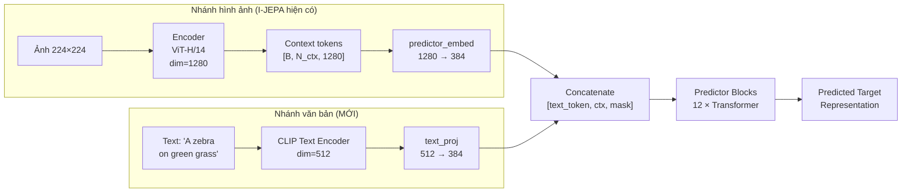
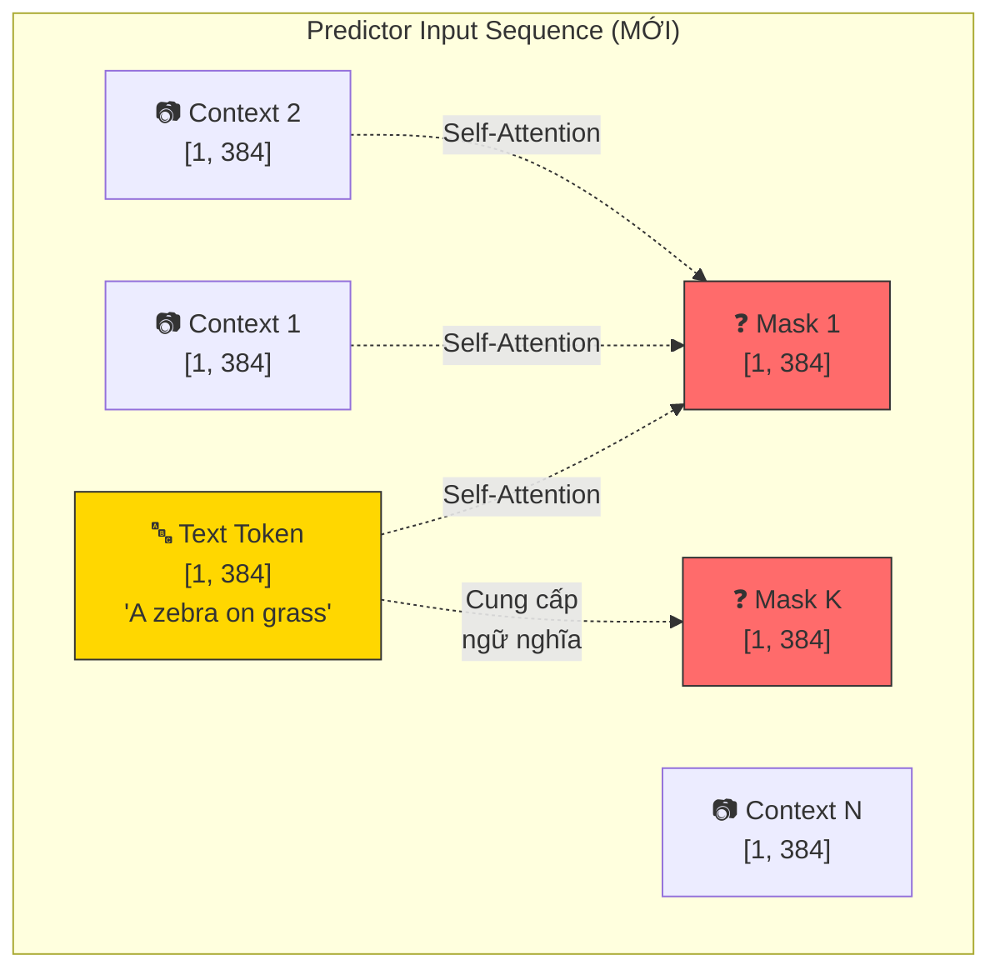

# Chiến lược 1: Multi-modal Knowledge Injection — Hướng dẫn triển khai chi tiết

## Mục tiêu

Tích hợp đặc trưng văn bản từ **CLIP** vào **I-JEPA Predictor** để "neo" Predictor vào đúng ngữ nghĩa đối tượng, từ đó tăng prediction error khi gặp vùng ảnh bị chỉnh sửa.

## Kiến trúc tổng quan



## Phân tích chiều dữ liệu (Dimension Analysis)

| Thành phần | Shape | Chi tiết |
|:---|:---|:---|
| Encoder output | `[B, 256, 1280]` | 16×16 patches, ViT-H embed_dim |
| Context tokens (sau mask) | `[B, N_ctx, 1280]` | N_ctx ≤ 256 |
| Predictor embed | `[B, N_ctx, 384]` | Sau linear projection |
| Mask tokens | `[B, N_tgt, 384]` | N_tgt = 256 - N_ctx |
| **CLIP text embed** | `[B, 512]` | Từ CLIP ViT-B/32 |
| **Text token (sau proj)** | `[B, 1, 384]` | Linear 512 → 384 |
| Predictor input (mới) | `[B, 1 + N_ctx + N_tgt, 384]` | Thêm 1 text token |

## Triển khai chi tiết — 3 Giai đoạn

---

### Giai đoạn 1: Cài đặt CLIP và tạo Text Embedding Extractor

#### Bước 1.1: Cài đặt OpenAI CLIP

```bash
source /mnt/storage/anaconda3/bin/activate ijepa_legacy
pip install git+https://github.com/openai/CLIP.git
```

#### Bước 1.2: Tạo file `clip_text_encoder.py`

Tạo file mới tại `/home/uslib/quynhhuong/ijepa/src/models/clip_text_encoder.py`:

```python
import torch
import torch.nn as nn
import clip


class CLIPTextEncoder(nn.Module):
    """
    Trích xuất text embedding từ CLIP.
    Đầu ra: vector 512 chiều cho mỗi caption.
    """
    def __init__(self, model_name="ViT-B/32", device="cuda"):
        super().__init__()
        self.device = device
        self.clip_model, _ = clip.load(model_name, device=device)
        self.clip_model.eval()
        
        # Freeze CLIP — không train lại
        for param in self.clip_model.parameters():
            param.requires_grad = False
    
    @torch.no_grad()
    def forward(self, text_list):
        """
        Args:
            text_list: list of strings, e.g. ["A zebra standing on grass"]
        Returns:
            text_features: [B, 512] normalized text embeddings
        """
        tokens = clip.tokenize(text_list, truncate=True).to(self.device)
        text_features = self.clip_model.encode_text(tokens)
        text_features = text_features.float()  # FP32 cho Maxwell GPU
        text_features = text_features / text_features.norm(dim=-1, keepdim=True)
        return text_features
```

> [!NOTE]
> Dùng CLIP ViT-B/32 (nhẹ nhất, ~150MB) vì chỉ cần text encoder. Nếu muốn mạnh hơn, có thể thay bằng ViT-L/14 (dim=768).

---

### Giai đoạn 2: Sửa đổi I-JEPA Predictor — Thêm Text Conditioning

#### Phương pháp: **Prepend Text Token**

Cách đơn giản và hiệu quả nhất: thêm CLIP text embedding như một "token đặc biệt" đầu tiên trong chuỗi input của Predictor. Transformer's self-attention sẽ tự động cho phép tất cả các patch tokens "tham khảo" thông tin ngữ nghĩa từ text token này.

#### Bước 2.1: Tạo `VisionTransformerPredictorWithText`

Tạo class kế thừa từ Predictor gốc, tại `/home/uslib/quynhhuong/ijepa/src/models/text_conditioned_predictor.py`:

```python
import torch
import torch.nn as nn
import torch.nn.functional as F

from src.models.vision_transformer import VisionTransformerPredictor, get_2d_sincos_pos_embed
from src.masks.utils import apply_masks
from src.utils.tensors import repeat_interleave_batch


class VisionTransformerPredictorWithText(VisionTransformerPredictor):
    """
    I-JEPA Predictor với text conditioning từ CLIP.
    
    Kế thừa VisionTransformerPredictor gốc, thêm:
    - text_proj: Linear(clip_dim → predictor_embed_dim)
    - text_token_embed: learnable embedding cho vị trí text token
    
    Forward flow:
    1. Project context tokens (giống gốc)
    2. Project CLIP text embedding → text_token [B, 1, D]  
    3. Concatenate: [text_token, context_tokens, mask_tokens]
    4. Qua Transformer blocks (giống gốc)
    5. Trả về predictions cho mask tokens (bỏ text token)
    """
    
    def __init__(
        self,
        num_patches,
        embed_dim=768,
        predictor_embed_dim=384,
        clip_embed_dim=512,      # <-- MỚI
        depth=6,
        num_heads=12,
        mlp_ratio=4.0,
        qkv_bias=True,
        qk_scale=None,
        drop_rate=0.0,
        attn_drop_rate=0.0,
        drop_path_rate=0.0,
        norm_layer=nn.LayerNorm,
        init_std=0.02,
        **kwargs
    ):
        super().__init__(
            num_patches=num_patches,
            embed_dim=embed_dim,
            predictor_embed_dim=predictor_embed_dim,
            depth=depth,
            num_heads=num_heads,
            mlp_ratio=mlp_ratio,
            qkv_bias=qkv_bias,
            qk_scale=qk_scale,
            drop_rate=drop_rate,
            attn_drop_rate=attn_drop_rate,
            drop_path_rate=drop_path_rate,
            norm_layer=norm_layer,
            init_std=init_std,
            **kwargs
        )
        
        # -- MỚI: Text conditioning layers
        self.text_proj = nn.Linear(clip_embed_dim, predictor_embed_dim, bias=True)
        self.text_pos_embed = nn.Parameter(
            torch.zeros(1, 1, predictor_embed_dim)
        )
        nn.init.trunc_normal_(self.text_pos_embed, std=init_std)
    
    def forward(self, x, masks_x, masks, text_embed=None):
        """
        Args:
            x: context tokens [B*len(masks_x), N_ctx, embed_dim]
            masks_x: context mask indices
            masks: target mask indices  
            text_embed: CLIP text features [B, clip_dim] (optional)
        """
        assert (masks is not None) and (masks_x is not None)

        if not isinstance(masks_x, list):
            masks_x = [masks_x]
        if not isinstance(masks, list):
            masks = [masks]

        B = len(x) // len(masks_x)

        # -- Map from encoder-dim to predictor-dim (giống gốc)
        x = self.predictor_embed(x)
        x_pos_embed = self.predictor_pos_embed.repeat(B, 1, 1)
        x += apply_masks(x_pos_embed, masks_x)

        _, N_ctxt, D = x.shape

        # -- Concat mask tokens (giống gốc)
        pos_embs = self.predictor_pos_embed.repeat(B, 1, 1)
        pos_embs = apply_masks(pos_embs, masks)
        pos_embs = repeat_interleave_batch(pos_embs, B, repeat=len(masks_x))
        pred_tokens = self.mask_token.repeat(pos_embs.size(0), pos_embs.size(1), 1)
        pred_tokens += pos_embs
        x = x.repeat(len(masks), 1, 1)
        x = torch.cat([x, pred_tokens], dim=1)

        # -- MỚI: Thêm text token nếu có
        has_text = text_embed is not None
        if has_text:
            # Project text: [B, clip_dim] → [B, 1, pred_dim]
            text_token = self.text_proj(text_embed).unsqueeze(1)
            text_token = text_token + self.text_pos_embed
            # Repeat cho multi-mask nếu cần
            text_token = text_token.repeat(x.size(0) // B, 1, 1)
            # Prepend text token
            x = torch.cat([text_token, x], dim=1)

        # -- Forward qua transformer blocks (giống gốc)
        for blk in self.predictor_blocks:
            x = blk(x)
        x = self.predictor_norm(x)

        # -- Bỏ text token, lấy phần mask tokens
        if has_text:
            x = x[:, 1:]  # Bỏ text token đầu tiên
        x = x[:, N_ctxt:]  # Lấy predictions cho target tokens
        x = self.predictor_proj(x)

        return x
```

#### Bước 2.2: Giải thích cơ chế hoạt động



**Tại sao prepend hoạt động?** Trong self-attention, mỗi mask token attend tới TẤT CẢ tokens trước nó, bao gồm cả text token. Text token đóng vai trò "global semantic anchor":
- Khi text nói "zebra" → mask tokens sẽ được neo vào ngữ nghĩa "zebra" → dự đoán sọc vằn, hình dáng ngựa vằn
- Nếu vùng thực tế là "ngựa thường" (bị ghép) → prediction error cực lớn

---

### Giai đoạn 3: Xây dựng Inference Pipeline cho Manipulation Detection

#### Bước 3.1: Tạo `clip_ijepa_inference.py`

Tạo tại `/home/uslib/quynhhuong/ijepa/scripts/clip_ijepa_inference.py`:

```python
import torch
import torch.nn.functional as F
import numpy as np
import matplotlib.pyplot as plt
from PIL import Image
import os, sys, argparse

sys.path.insert(0, os.path.join(os.path.dirname(__file__), '..'))

from src.models.clip_text_encoder import CLIPTextEncoder
from src.models.text_conditioned_predictor import VisionTransformerPredictorWithText
from src.models.vision_transformer import vit_huge, VIT_EMBED_DIMS
from src.helper import init_model
from src.masks.utils import apply_masks


class CLIPIJEPAManipulationDetector:
    """
    Phát hiện vùng bị chỉnh sửa bằng I-JEPA + CLIP text conditioning.
    
    Pipeline:
    1. CLIP Text Encoder: "A zebra on grass" → text_embed [512]
    2. I-JEPA Encoder: image → patch representations [256, 1280]
    3. Duyệt qua từng vùng (sliding window):
       a. Ẩn vùng đó (mask)
       b. Predictor + text conditioning → dự đoán representation
       c. So sánh prediction vs ground truth → anomaly score
    4. Tạo anomaly heatmap
    """
    
    def __init__(self, checkpoint_path, device='cuda'):
        self.device = device
        self.patch_size = 14
        self.img_size = 224
        self.grid_size = self.img_size // self.patch_size  # 16
        
        # 1. CLIP Text Encoder
        self.text_encoder = CLIPTextEncoder(model_name="ViT-B/32", device=device)
        
        # 2. I-JEPA Encoder (tải weights gốc)
        self.encoder, _ = init_model(
            device=device,
            patch_size=self.patch_size,
            model_name='vit_huge',
            crop_size=self.img_size,
            pred_depth=12,
            pred_emb_dim=384
        )
        
        # 3. Text-Conditioned Predictor (MỚI)
        self.predictor = VisionTransformerPredictorWithText(
            num_patches=self.grid_size ** 2,  # 256
            embed_dim=VIT_EMBED_DIMS['vit_huge'],  # 1280
            predictor_embed_dim=384,
            clip_embed_dim=512,
            depth=12,
            num_heads=12
        ).to(device)
        
        # 4. Tải checkpoint I-JEPA
        self._load_checkpoint(checkpoint_path)
        
        # 5. Transform
        from torchvision import transforms
        self.transform = transforms.Compose([
            transforms.Resize(256),
            transforms.CenterCrop(224),
            transforms.ToTensor(),
            transforms.Normalize(mean=[0.485, 0.456, 0.406],
                                 std=[0.229, 0.224, 0.225])
        ])
    
    def _load_checkpoint(self, path):
        """Tải weights I-JEPA, bỏ qua các layer mới (text_proj, text_pos_embed)."""
        checkpoint = torch.load(path, map_location='cpu')
        
        # Encoder
        enc_state = checkpoint['encoder']
        if any(k.startswith('module.') for k in enc_state):
            enc_state = {k.replace('module.', ''): v for k, v in enc_state.items()}
        self.encoder.load_state_dict(enc_state)
        
        # Predictor — load với strict=False để bỏ qua text_proj, text_pos_embed
        pred_state = checkpoint['predictor']
        if any(k.startswith('module.') for k in pred_state):
            pred_state = {k.replace('module.', ''): v for k, v in pred_state.items()}
        missing, unexpected = self.predictor.load_state_dict(pred_state, strict=False)
        print(f"Loaded predictor (missing: {missing}, unexpected: {unexpected})")
        
        self.encoder.eval()
        self.predictor.eval()
    
    def detect(self, image_path, text_description, output_path,
               window_size=4, stride=2):
        """
        Phát hiện vùng bị chỉnh sửa.
        
        Args:
            image_path: đường dẫn ảnh
            text_description: mô tả nội dung ảnh gốc (trước khi bị sửa)
            output_path: đường dẫn lưu kết quả
            window_size: kích thước cửa sổ quét (tính theo patch)
            stride: bước nhảy quét
        """
        os.makedirs(os.path.dirname(output_path), exist_ok=True)
        
        # 1. Encode text
        text_embed = self.text_encoder([text_description])  # [1, 512]
        
        # 2. Encode image
        img = Image.open(image_path).convert('RGB')
        img_tensor = self.transform(img).unsqueeze(0).to(self.device)
        
        with torch.no_grad():
            full_rep = self.encoder(img_tensor)  # [1, 256, 1280]
            h_norm = F.layer_norm(full_rep, (full_rep.size(-1),))
        
        # 3. Sliding window anomaly detection
        anomaly_map = torch.zeros(self.grid_size, self.grid_size)
        count_map = torch.zeros(self.grid_size, self.grid_size)
        
        for top in range(0, self.grid_size - window_size + 1, stride):
            for left in range(0, self.grid_size - window_size + 1, stride):
                # Target mask
                mask = torch.zeros(self.grid_size, self.grid_size, dtype=torch.int32)
                mask[top:top+window_size, left:left+window_size] = 1
                target_idx = torch.nonzero(mask.flatten()).squeeze().to(self.device).unsqueeze(0)
                context_idx = torch.nonzero(1 - mask.flatten()).squeeze().to(self.device).unsqueeze(0)
                
                with torch.no_grad():
                    # Ground truth
                    target_gt = apply_masks(h_norm, target_idx)
                    
                    # Prediction WITH text conditioning
                    context_rep = apply_masks(full_rep, context_idx)
                    target_pred_with_text = self.predictor(
                        context_rep, context_idx, target_idx,
                        text_embed=text_embed
                    )
                    
                    # Prediction WITHOUT text conditioning
                    target_pred_no_text = self.predictor(
                        context_rep, context_idx, target_idx,
                        text_embed=None
                    )
                    
                    # Anomaly score = L1 error (with text) 
                    # Text anchoring sẽ tăng error tại vùng bị sửa
                    error_with = torch.mean(torch.abs(target_pred_with_text - target_gt), dim=-1)
                    error_without = torch.mean(torch.abs(target_pred_no_text - target_gt), dim=-1)
                    
                    # Compute difference: nếu text conditioning làm tăng error → vùng bất thường
                    # Nếu text conditioning làm giảm error → vùng hợp lý
                    anomaly = error_with.mean().cpu()
                
                anomaly_map[top:top+window_size, left:left+window_size] += anomaly
                count_map[top:top+window_size, left:left+window_size] += 1
        
        # Normalize
        count_map = torch.clamp(count_map, min=1)
        anomaly_map = anomaly_map / count_map
        
        # 4. Visualize
        self._visualize(img_tensor, anomaly_map, output_path, text_description)
        
        return anomaly_map
    
    def _visualize(self, img_tensor, anomaly_map, output_path, text):
        """Tạo visualization với anomaly heatmap."""
        fig, axes = plt.subplots(1, 3, figsize=(18, 6))
        
        # Original image
        img_np = img_tensor[0].permute(1, 2, 0).cpu().numpy()
        img_np = img_np * np.array([0.229, 0.224, 0.225]) + np.array([0.485, 0.456, 0.406])
        img_np = np.clip(img_np, 0, 1)
        axes[0].imshow(img_np)
        axes[0].set_title("Original Image")
        axes[0].axis('off')
        
        # Anomaly heatmap
        am = anomaly_map.numpy()
        im = axes[1].imshow(am, cmap='hot', interpolation='nearest')
        axes[1].set_title(f"Anomaly Map (text: '{text}')")
        axes[1].axis('off')
        plt.colorbar(im, ax=axes[1])
        
        # Overlay
        from scipy.ndimage import zoom
        am_resized = zoom(am, 224 / am.shape[0], order=1)
        axes[2].imshow(img_np)
        axes[2].imshow(am_resized, cmap='hot', alpha=0.5)
        axes[2].set_title("Anomaly Overlay")
        axes[2].axis('off')
        
        plt.tight_layout()
        plt.savefig(output_path, dpi=150, bbox_inches='tight')
        plt.close()
        print(f"Saved to {output_path}")


if __name__ == '__main__':
    parser = argparse.ArgumentParser()
    parser.add_argument('--checkpoint', type=str, required=True)
    parser.add_argument('--image', type=str, required=True)
    parser.add_argument('--text', type=str, required=True,
                        help='Description of the ORIGINAL image content')
    parser.add_argument('--output', type=str, default='output_clip_detect.png')
    parser.add_argument('--window_size', type=int, default=4)
    parser.add_argument('--stride', type=int, default=2)
    args = parser.parse_args()
    
    detector = CLIPIJEPAManipulationDetector(
        checkpoint_path=args.checkpoint
    )
    detector.detect(
        image_path=args.image,
        text_description=args.text,
        output_path=args.output,
        window_size=args.window_size,
        stride=args.stride
    )
```

#### Bước 3.2: Cách chạy

```bash
# Cài CLIP
pip install git+https://github.com/openai/CLIP.git

# Chạy detection
python scripts/clip_ijepa_inference.py \
  --checkpoint /path/to/ijepa-vith14-300ep.pth \
  --image /path/to/suspicious_image.jpg \
  --text "A zebra standing on green grass" \
  --output output_manipulation_detect.png \
  --window_size 4 \
  --stride 2
```

---

## Lưu ý quan trọng

> [!IMPORTANT]
> **Không cần fine-tune toàn bộ model.** Vì text_proj và text_pos_embed là layers mới (khởi tạo random), lần đầu chạy chúng sẽ cho kết quả chưa tốt. Có 2 cách:
>
> **Cách A (Nhanh, zero-shot):** Dùng ngay — text token sẽ hoạt động như thêm "nhiễu có cấu trúc" vào Predictor. Vẫn hữu ích vì self-attention tự học biểu diễn ý nghĩa.
>
> **Cách B (Tốt hơn, cần fine-tune):** Fine-tune chỉ 2 layers mới (`text_proj`, `text_pos_embed`) trên một tập ảnh nhỏ (~1000 ảnh) với caption. Freeze tất cả layers I-JEPA gốc. Chỉ cần vài epoch.

> [!WARNING]
> **GPU memory:** CLIP ViT-B/32 chỉ thêm ~150MB VRAM. Tổng ước tính khi chạy: I-JEPA Encoder (~3GB) + Predictor (~200MB) + CLIP (~150MB) ≈ **~3.5GB**. Phù hợp với Maxwell 24GB.

## Bước tiếp theo

1. Cài CLIP vào environment `ijepa_legacy`
2. Tạo 2 file: `clip_text_encoder.py` và `text_conditioned_predictor.py`
3. Tạo `clip_ijepa_inference.py`
4. Chạy thử nghiệm trên ảnh zebra (đã có) với text "A zebra standing on green grass"
5. So sánh anomaly map có text vs. không text
