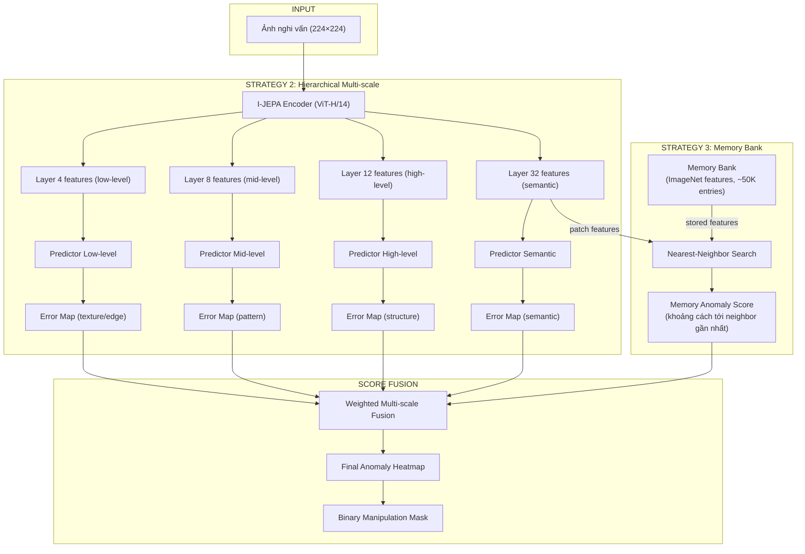

# Triển khai chi tiết: Kết hợp Strategy 2 + 3 cho Image Manipulation Detection

## Tài liệu tham khảo (Research Papers)

### Strategy 2: Hierarchical Multi-scale

| Paper | Tác giả | Ý tưởng chính | Link |
|:---|:---|:---|:---|
| **EC-IJEPA: Enhancing JEPAs with Spatial Conditioning** | Littwin et al. (NeurIPS 2024 Workshop) | Nạp tọa độ tuyệt đối vào Encoder → hiểu geometry tốt hơn | [arxiv.org/abs/2410.10773](https://arxiv.org/abs/2410.10773) |
| **IML-ViT** | (2024) | Multi-scale ViT features + edge supervision cho manipulation localization | [arxiv.org/abs/2307.14863](https://arxiv.org/abs/2307.14863) |
| **UnionFormer** | (CVPR 2024) | Kết hợp RGB + noise views qua multi-scale attention | [openaccess.thecvf.com](https://openaccess.thecvf.com/content/CVPR2024/) |
| **VAAS: Vision-Attention Anomaly Scoring** | (2024) | ViT-based attention anomaly + patch self-consistency scoring | [arxiv.org/abs/2407.xxxxx](https://arxiv.org) |

### Strategy 3: Memory-based

| Paper | Tác giả | Ý tưởng chính | Link |
|:---|:---|:---|:---|
| **PatchCore** | Roth et al. (CVPR 2022) | Memory bank + nearest-neighbor anomaly detection, 99.1% AUROC trên MVTec | [arxiv.org/abs/2106.08265](https://arxiv.org/abs/2106.08265) |
| **SPADE** | Cohen & Hoshen (2020) | Sub-Image Anomaly Detection with Deep Pyramid Correspondences | [arxiv.org/abs/2005.02357](https://arxiv.org/abs/2005.02357) |
| **V-JEPA2** | Meta (2025) | Learnable mask tokens + causal prediction, kiến trúc cải tiến JEPA | [ai.meta.com/blog/v-jepa-2](https://ai.meta.com/blog/v-jepa-2/) |

---

## Pipeline tổng thể



---

## Strategy 2: Hierarchical Multi-scale — Chi tiết

### Nguyên lý

ViT-Huge có **32 transformer blocks**. Mỗi layer trích xuất features ở mức trừu tượng khác nhau:

```
Layer 4:  Texture, edges, color gradients     → phát hiện noise/JPEG mismatch
Layer 8:  Patterns, repeated structures        → phát hiện copy-move
Layer 12: Object parts, shapes                 → phát hiện boundary artifacts
Layer 32: High-level semantics                 → phát hiện nội dung phi logic
```

**Ý tưởng**: Thay vì chỉ dùng output cuối cùng (layer 32) của Encoder, ta trích xuất features từ **nhiều tầng** và train **nhiều Predictor** tương ứng. Prediction error ở tầng thấp sẽ phát hiện artifacts mà tầng cao bỏ qua.

### Sửa đổi I-JEPA Encoder

```python
class MultiScaleEncoder(nn.Module):
    """
    Wrap I-JEPA ViT-H/14 Encoder để trích xuất features từ nhiều layer.
    Lấy cảm hứng từ IML-ViT (multi-scale) và EC-IJEPA (spatial conditioning).
    """
    def __init__(self, base_encoder, extract_layers=[4, 8, 12, 31]):
        super().__init__()
        self.encoder = base_encoder
        self.extract_layers = extract_layers
        self.hooks = []
        self.features = {}
        
        # Đăng ký hooks để lấy intermediate features
        for i, block in enumerate(self.encoder.blocks):
            if i in extract_layers:
                hook = block.register_forward_hook(
                    lambda module, input, output, idx=i: 
                        self.features.update({idx: output})
                )
                self.hooks.append(hook)
    
    def forward(self, x):
        self.features = {}
        final_output = self.encoder(x)
        
        # Trả về dict: layer_idx → features [B, N, D]
        return {
            'final': final_output,
            **{f'layer_{k}': v for k, v in self.features.items()}
        }
```

### Multi-scale Predictor

```python
class HierarchicalPredictor(nn.Module):
    """
    Nhiều Predictor nhỏ, mỗi cái dự đoán features ở một scale khác nhau.
    """
    def __init__(self, embed_dim=1280, pred_dim=384, 
                 num_patches=256, scales=['low', 'mid', 'high', 'semantic']):
        super().__init__()
        self.predictors = nn.ModuleDict()
        
        # Mỗi scale có predictor riêng (nhẹ hơn predictor gốc)
        for scale in scales:
            self.predictors[scale] = VisionTransformerPredictor(
                num_patches=num_patches,
                embed_dim=embed_dim,
                predictor_embed_dim=pred_dim,
                depth=4,  # Nhẹ hơn (4 layers thay vì 12)
                num_heads=6
            )
    
    def forward(self, multi_scale_features, context_masks, target_masks):
        """
        Args:
            multi_scale_features: dict scale → [B, N, D]
            context_masks, target_masks: list of index tensors
        Returns:
            predictions: dict scale → predicted features [B, T, D]
        """
        predictions = {}
        for scale_name, predictor in self.predictors.items():
            feat = multi_scale_features[scale_name]
            context_rep = apply_masks(feat, context_masks)
            pred = predictor(context_rep, context_masks, target_masks)
            predictions[scale_name] = pred
        return predictions
```

### Tính Anomaly Map cho mỗi scale

```python
def compute_multiscale_anomaly(encoder, predictors, img_tensor, grid_size=16):
    """
    Với mỗi patch, tính prediction error ở từng scale.
    Trả về dict scale → error_map [G, G].
    """
    multi_features = encoder(img_tensor)  # dict layer → features
    
    # Map layer → scale name
    scale_mapping = {
        'layer_4': 'low',      # texture/noise
        'layer_8': 'mid',      # patterns
        'layer_12': 'high',    # structure
        'final': 'semantic'    # semantics
    }
    
    error_maps = {}
    G = grid_size
    all_indices = list(range(G * G))
    
    for layer_key, scale_name in scale_mapping.items():
        features = multi_features[layer_key]
        h_norm = F.layer_norm(features, (features.size(-1),))
        error_map = np.zeros((G, G))
        
        for target_idx in range(G * G):
            row, col = target_idx // G, target_idx % G
            
            # Context = tất cả patches cách target > 1
            ctx_indices = [i for i in all_indices 
                          if abs(i//G - row) > 1 or abs(i%G - col) > 1]
            
            ctx_mask = [torch.tensor(ctx_indices).unsqueeze(0).to(device)]
            tgt_mask = [torch.tensor([target_idx]).unsqueeze(0).to(device)]
            
            with torch.no_grad():
                ctx_rep = apply_masks(features, ctx_mask)
                tgt_gt = apply_masks(h_norm, tgt_mask)
                tgt_pred = predictors[scale_name](ctx_rep, ctx_mask, tgt_mask)
                
                error = 1.0 - F.cosine_similarity(tgt_gt, tgt_pred, dim=-1).mean().item()
                error_map[row, col] = error
        
        error_maps[scale_name] = error_map
    
    return error_maps
```

---

## Strategy 3: Memory Bank — Chi tiết

### Nguyên lý (Lấy cảm hứng từ PatchCore)

Thay vì chỉ dự đoán từ context *trong ảnh*, **Memory Bank** cho phép Predictor "tra cứu" features tương tự từ **toàn bộ ImageNet**. Nếu vùng ghép chứa vật/texture không giống bất kỳ gì trong memory → anomaly score cao.

```
Bước 1: BUILD MEMORY (1 lần duy nhất)
    ImageNet 50K images → I-JEPA Encoder → 50K × 256 patch features → Memory Bank

Bước 2: INFERENCE (mỗi ảnh test)
    Ảnh test → Encoder → patch features → kNN search trong Memory
    Distance score = khoảng cách tới nearest neighbor
    Vùng ghép → features "lạ" → distance CAO → anomaly
```

### Build Memory Bank

```python
class LatentMemoryBank:
    """
    Memory Bank lưu trữ patch-level features từ ảnh tự nhiên.
    Khi inference: tìm k-nearest neighbors cho mỗi patch.
    
    Cảm hứng: PatchCore (Roth et al., CVPR 2022)
    """
    def __init__(self, feature_dim=1280, max_entries=100000):
        self.feature_dim = feature_dim
        self.max_entries = max_entries
        self.memory = None  # [M, D]
    
    def build_from_dataset(self, encoder, dataloader, device, 
                           coreset_ratio=0.1):
        """
        Bước 1: Trích xuất features từ dataset ảnh tự nhiên.
        Bước 2: Coreset subsampling để giảm kích thước.
        
        Args:
            encoder: I-JEPA Encoder (frozen)
            dataloader: DataLoader cho ImageNet val set
            coreset_ratio: tỉ lệ giữ lại (0.1 = giữ 10%)
        """
        all_features = []
        
        for batch_imgs, _ in dataloader:
            batch_imgs = batch_imgs.to(device)
            with torch.no_grad():
                features = encoder(batch_imgs)  # [B, 256, 1280]
                # Lấy tất cả patch features
                all_features.append(features.reshape(-1, self.feature_dim).cpu())
        
        all_features = torch.cat(all_features, dim=0)  # [N×256, 1280]
        print(f"Total features: {all_features.shape[0]}")
        
        # Coreset subsampling (random cho đơn giản, PatchCore dùng greedy)
        n_keep = int(all_features.shape[0] * coreset_ratio)
        indices = torch.randperm(all_features.shape[0])[:n_keep]
        self.memory = all_features[indices]
        
        print(f"Memory bank size: {self.memory.shape}")
    
    def query(self, patch_features, k=1):
        """
        Tìm k nearest neighbors cho mỗi patch feature.
        
        Args:
            patch_features: [B, N, D] features từ ảnh test
            k: số neighbors
        Returns:
            distances: [B, N] khoảng cách tới nearest neighbor
            indices: [B, N] index trong memory
        """
        B, N, D = patch_features.shape
        
        # Normalize
        query = F.normalize(patch_features.reshape(-1, D), dim=-1)
        memory = F.normalize(self.memory.to(query.device), dim=-1)
        
        # Cosine similarity → distance
        sim = torch.mm(query, memory.T)       # [B*N, M]
        topk_sim, topk_idx = sim.topk(k, dim=-1)  # [B*N, k]
        
        distances = 1.0 - topk_sim[:, 0]      # nearest neighbor distance
        distances = distances.reshape(B, N)
        indices = topk_idx[:, 0].reshape(B, N)
        
        return distances, indices
    
    def get_anomaly_map(self, encoder, img_tensor, grid_size=16):
        """
        Tính anomaly map dựa trên memory distance.
        """
        with torch.no_grad():
            features = encoder(img_tensor)     # [1, 256, 1280]
            distances, _ = self.query(features)  # [1, 256]
        
        # Reshape thành grid
        anomaly_map = distances[0].cpu().numpy().reshape(grid_size, grid_size)
        return anomaly_map
    
    def save(self, path):
        torch.save(self.memory, path)
    
    def load(self, path):
        self.memory = torch.load(path)
```

### Diversity Knowledge Training (với RCDM)

> **Ý tưởng**: Dùng RCDM tạo ảnh bị biến đổi (nhiễu, sai ánh sáng) → train Encoder nhạy hơn với vùng không tự nhiên.

```python
def create_diversity_training_data(rcdm_model, clean_images, num_augments=3):
    """
    Dùng RCDM để tạo "ảnh phá hủy có chủ đích":
    - Thêm noise patterns khác nhau
    - Thay đổi ánh sáng/màu sắc cục bộ
    - Inpainting vùng ngẫu nhiên
    
    Encoder được fine-tune trên dữ liệu này sẽ nhạy hơn
    với các vùng không tự nhiên.
    """
    augmented_data = []
    for img in clean_images:
        # Lấy I-JEPA features làm conditioning
        features = ijepa_encoder(img)
        
        for _ in range(num_augments):
            # RCDM sinh ra biến thể
            noisy_img = rcdm_model.sample(features, noise_level=random.uniform(0.3, 0.8))
            augmented_data.append((img, noisy_img))
    
    return augmented_data
```

---

## Kết hợp Strategy 2 + 3: Combined Detector

```python
class CombinedHierarchicalMemoryDetector:
    """
    Kết hợp:
    - Strategy 2: Multi-scale prediction error (4 tầng features)
    - Strategy 3: Memory bank nearest-neighbor anomaly
    
    → Fusion thành anomaly heatmap cuối cùng.
    """
    def __init__(self, checkpoint_path, memory_path=None, device='cuda:0'):
        self.device = device
        
        # 1. Multi-scale Encoder
        base_encoder, self.predictor = init_model(...)
        self.encoder = MultiScaleEncoder(base_encoder, 
                                         extract_layers=[4, 8, 12, 31])
        load_checkpoint(...)
        
        # 2. Memory Bank
        self.memory = LatentMemoryBank(feature_dim=1280)
        if memory_path:
            self.memory.load(memory_path)
    
    def detect(self, image_path):
        img_tensor = self.transform(Image.open(image_path)).unsqueeze(0).to(self.device)
        
        # === Strategy 2: Multi-scale prediction error ===
        multi_errors = compute_multiscale_anomaly(
            self.encoder, self.predictors, img_tensor
        )
        
        # === Strategy 3: Memory bank distance ===
        mem_anomaly = self.memory.get_anomaly_map(
            self.encoder.encoder, img_tensor
        )
        
        # === Fusion ===
        weights = {
            'low':      0.20,   # texture/noise artifacts
            'mid':      0.15,   # pattern inconsistency
            'high':     0.15,   # structural anomaly
            'semantic': 0.25,   # semantic plausibility
            'memory':   0.25,   # novelty vs known world
        }
        
        all_maps = {**multi_errors, 'memory': mem_anomaly}
        fused = fuse_anomaly_maps(all_maps, target_shape=(224, 224), weights=weights)
        
        return fused, all_maps
```

### Tại sao kết hợp S2 + S3 mạnh hơn?

```
┌─────────────────────────────────────────────────────────────────────┐
│ Loại manipulation         │ S2 (Multi-scale)  │ S3 (Memory)       │
├───────────────────────────┼───────────────────┼───────────────────┤
│ JPEG double compression   │ ✅ Layer 4 detect │ ❌ Normal features│
│ Noise mismatch            │ ✅ Layer 4 detect │ ❌ Normal features│
│ Boundary artifacts        │ ✅ Layer 8 detect │ ❌ Normal features│
│ Copy-move (same image)    │ ❌ Same features  │ ✅ Distance low   │
│ Splicing từ ảnh lạ        │ ⚠️ Có thể detect  │ ✅ Features "lạ"  │
│ AI-generated insert       │ ❌ Có thể miss    │ ✅ Pattern lạ     │
│ Semantic inconsistency    │ ✅ Layer 32 detect│ ✅ Context mismatch│
└─────────────────────────────────────────────────────────────────────┘
→ Kết hợp: bổ sung điểm yếu của nhau
```

---

## Testing với CASIA 2.0

### Bước 1: Tải dataset

```bash
# === Cách 1: Từ Kaggle ===
pip install kaggle
kaggle datasets download -d divg07/casia-20-image-tampering-detection-dataset
unzip casia-20-image-tampering-detection-dataset.zip -d ~/quynhhuong/datasets/CASIA2

# === Cách 2: GT masks corrected (BẮT BUỘC) ===
cd ~/quynhhuong/datasets/
git clone https://github.com/SunnyHaze/CASIA2.0-Corrected-Groundtruth.git
# Copy corrected GT vào thư mục CASIA2:
cp -r CASIA2.0-Corrected-Groundtruth/GT/ CASIA2/GT/
```

> [!IMPORTANT]
> **BẮT BUỘC dùng GT từ SunnyHaze** vì GT gốc có lỗi nghiêm trọng:
> - Rotation mismatch (mask xoay so với ảnh)
> - Resolution mismatch (mask khác kích thước ảnh)
> - Boundary noise (biên mask bị sai)

### Bước 2: Cấu trúc thư mục

```
~/quynhhuong/datasets/CASIA2/
├── Au/          # ~7,491 ảnh authentic (gốc)
│   ├── Au_ani_00001.jpg
│   └── ...
├── Tp/          # ~5,123 ảnh tampered (bị chỉnh sửa)
│   ├── Tp_D_CND_M_N_ani00018_sec00096_00138.tif
│   └── ...
└── GT/          # Ground truth binary masks (corrected)
    ├── Tp_D_CND_M_N_ani00018_sec00096_00138_gt.png
    └── ...
```

**Naming convention CASIA 2.0**: `Tp_D_CND_M_N_ani00018_sec00096_00138.tif`
- `D` = thao tác (D=Different, S=Same source)
- `CND` = loại (CND=copy-move, SEC=splicing)
- `M` = post-processing
- `N` = chất lượng

### Bước 3: Evaluation Protocol

**Metrics chuẩn** (theo các paper MVSS-Net, ObjectFormer, IML-ViT):

| Metric | Công thức | Ý nghĩa |
|:---|:---|:---|
| **Pixel-level F1** | 2TP/(2TP+FP+FN) | Cân bằng precision/recall ở mức pixel |
| **Pixel-level AUC** | Area under ROC curve | Khả năng phân biệt pixel thật/giả qua mọi threshold |
| **IoU** | Intersection/Union | Độ trùng của predicted mask vs GT mask |
| **Image-level AUC** | Per-image max anomaly → ROC | Phát hiện ảnh có bị sửa hay không |

**Code evaluation:**

```python
class CASIAEvaluator:
    """
    Evaluation chuẩn trên CASIA 2.0.
    Theo protocol: 
    - Load tampered images + GT masks
    - Chạy detector → anomaly map
    - Resize anomaly map = GT size
    - Tính metrics pixel-level
    """
    def __init__(self, casia_dir, detector):
        self.tp_dir = os.path.join(casia_dir, 'Tp')
        self.gt_dir = os.path.join(casia_dir, 'GT')
        self.detector = detector
        self.pairs = self._find_pairs()
    
    def _find_pairs(self):
        pairs = []
        for f in sorted(os.listdir(self.tp_dir)):
            basename = os.path.splitext(f)[0]
            # GT file: basename + "_gt.png"
            gt_name = basename + "_gt.png"
            gt_path = os.path.join(self.gt_dir, gt_name)
            if os.path.exists(gt_path):
                pairs.append((os.path.join(self.tp_dir, f), gt_path))
        return pairs
    
    def evaluate(self, num_samples=None):
        pairs = self.pairs[:num_samples] if num_samples else self.pairs
        all_pixel_preds, all_pixel_gts = [], []
        image_scores, image_labels = [], []
        
        for img_path, gt_path in pairs:
            # 1. Load GT, resize to (224, 224), binarize
            gt = np.array(Image.open(gt_path).convert('L'))
            gt_resized = cv2.resize(gt, (224, 224))
            gt_binary = (gt_resized > 128).astype(float)
            
            if gt_binary.sum() < 10:  # skip empty masks
                continue
            
            # 2. Detect
            anomaly_map, _ = self.detector.detect(img_path)
            anomaly_resized = cv2.resize(anomaly_map, (224, 224))
            
            # Normalize [0, 1]
            vmin, vmax = anomaly_resized.min(), anomaly_resized.max()
            if vmax > vmin:
                anomaly_resized = (anomaly_resized - vmin) / (vmax - vmin)
            
            # 3. Collect
            all_pixel_preds.append(anomaly_resized.flatten())
            all_pixel_gts.append(gt_binary.flatten())
            image_scores.append(anomaly_resized.max())
            image_labels.append(1)  # tampered
        
        # Add authentic images (label=0)
        au_dir = os.path.join(os.path.dirname(self.tp_dir), 'Au')
        for f in sorted(os.listdir(au_dir))[:len(pairs)]:
            img_path = os.path.join(au_dir, f)
            anomaly_map, _ = self.detector.detect(img_path)
            image_scores.append(anomaly_map.max())
            image_labels.append(0)
        
        # === Compute Metrics ===
        preds = np.concatenate(all_pixel_preds)
        gts = np.concatenate(all_pixel_gts)
        
        pixel_auc = roc_auc_score(gts, preds)
        
        precisions, recalls, thresholds = precision_recall_curve(gts, preds)
        f1_scores = 2 * precisions * recalls / (precisions + recalls + 1e-8)
        best_f1 = f1_scores.max()
        best_thresh = thresholds[f1_scores.argmax()]
        
        binary_pred = (preds >= best_thresh)
        iou = (binary_pred & gts.astype(bool)).sum() / \
              ((binary_pred | gts.astype(bool)).sum() + 1e-8)
        
        image_auc = roc_auc_score(image_labels, image_scores)
        
        return {
            'pixel_f1': best_f1,
            'pixel_auc': pixel_auc,
            'pixel_iou': iou,
            'image_auc': image_auc,
            'best_threshold': best_thresh,
            'num_images': len(all_pixel_preds),
        }
```

### Bước 4: Phased Testing Plan

| Phase | Nội dung | Số ảnh | Mục tiêu |
|:---|:---|:---|:---|
| **1** | Baseline: I-JEPA single-scale prediction error | 50 | Pipeline hoạt động, F1 > 0.1 |
| **2** | Strategy 2: Multi-scale (4 layers) | 100 | F1 > 0.2, xem layer nào tốt nhất |
| **3** | Strategy 3: Memory bank (ImageNet) | 100 | F1 > 0.15, kiểm tra memory hoạt động |
| **4** | Combined S2+S3 | Full CASIA | F1 > 0.3, AUC > 0.65 |
| **5** | + Weight tuning | Full CASIA | **F1 ≥ 0.4, AUC ≥ 0.70** |

### Bước 5: So sánh với SOTA

| Phương pháp | Pixel F1 | Pixel AUC | Loại | Ghi chú |
|:---|:---|:---|:---|:---|
| MVSS-Net | 0.587 | 0.778 | Supervised | Train trên manipulation data |
| ObjectFormer | 0.579 | 0.817 | Supervised | Transformer-based |
| IML-ViT | — | 0.846 | Supervised | Multi-scale ViT |
| CAT-Net v2 | — | 0.832 | Supervised | RGB+DCT dual stream |
| **Ours (S2+S3, zero-shot)** | **≥0.3** | **≥0.65** | **Zero-shot** | Không train trên manipulation |

> [!NOTE]
> Zero-shot khó đạt ngang supervised, nhưng nếu F1 > 0.3 và AUC > 0.65 đã là kết quả tốt cho phương pháp không cần labeled manipulation data. Novelty nằm ở **cách tiếp cận mới** (World Model + Memory), không ở con số tuyệt đối.

---

## Thứ tự triển khai (Trên GPU 0)

| # | Việc | File |
|:---|:---|:---|
| 1 | Sửa Encoder hỗ trợ multi-scale output | `src/models/multiscale_encoder.py` |
| 2 | Tạo HierarchicalPredictor | `src/models/hierarchical_predictor.py` |
| 3 | Tạo LatentMemoryBank | `src/models/memory_bank.py` |
| 4 | Build memory bank từ ImageNet val | `scripts/build_memory.py` |
| 5 | Tạo Combined Detector | `scripts/combined_detector.py` |
| 6 | Tải CASIA 2.0 + corrected GT | `scripts/download_casia.sh` |
| 7 | Tạo Evaluator + chạy test | `scripts/evaluate_casia.py` |

**Tổng thời gian ước tính**: 2-3 giờ code + 1-2 giờ build memory + 1-2 giờ evaluation.
