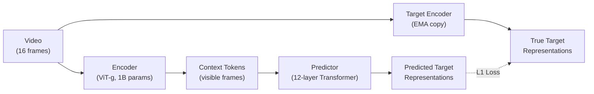
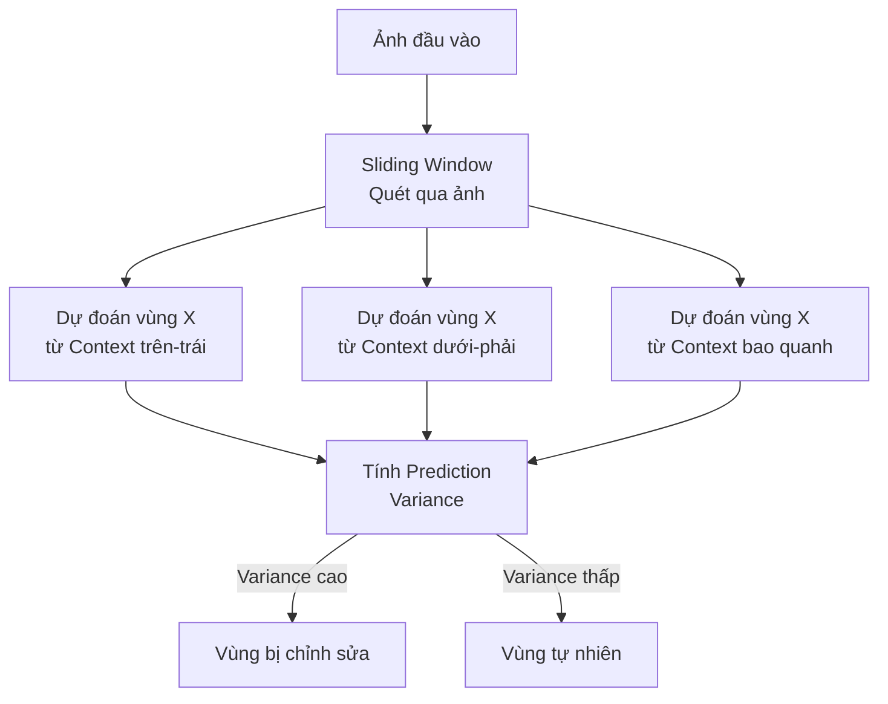

# Chiến lược 4: Temporal Consistency Prediction — Lấy cảm hứng từ V-JEPA 2

## Bối cảnh: V-JEPA 2 dùng World Model để dự đoán video như thế nào?

V-JEPA 2 ([paper](https://arxiv.org/abs/2506.09336), [source code](file:///home/uslib/quynhhuong/vjepa2)) mở rộng kiến trúc I-JEPA sang video, biến Predictor từ một bộ "nội suy không gian" thành một **World Model dự đoán tương lai** trong không gian biểu diễn ẩn.

### Cơ chế cốt lõi của V-JEPA 2



Qua phân tích source code [train.py](file:///home/uslib/quynhhuong/vjepa2/app/vjepa/train.py) và [predictor.py](file:///home/uslib/quynhhuong/vjepa2/src/models/predictor.py), V-JEPA 2 có các kỹ thuật sau:

| Kỹ thuật | Chi tiết từ source code | Ý nghĩa |
|:---|:---|:---|
| **Multi-scale Masking** | 8 block nhỏ (15% spatial) + 2 block lớn (70% spatial) | Buộc Predictor vừa hiểu chi tiết cục bộ vừa suy luận global |
| **Learnable Mask Tokens** | `self.mask_tokens` khởi tạo = 0, dùng như "câu hỏi" cho Predictor | Denoising objective — tokens bắt đầu từ nhiễu rồi học dự đoán |
| **Sorted Token Ordering** | `torch.argsort(masks)` để sắp context + target theo vị trí gốc | Predictor nhìn thấy đầy đủ cấu trúc không-thời gian |
| **EMA Target Encoder** | Momentum = 0.99925, cập nhật từng step | Teacher ổn định, tránh sụp đổ biểu diễn (representation collapse) |
| **Smooth L1 Loss** | `\|z - h\|^1` (loss_exp = 1.0) | Robust hơn MSE, ít nhạy cảm với outlier |
| **Frame-Causal Attention** | AC Predictor dùng causal mask + action/state tokens xen kẽ | Dự đoán frame tương lai chỉ từ thông tin quá khứ |
| **RoPE Positional Encoding** | Rotary positional embeddings thay cho sinusoidal | Tốt hơn cho generalization sang các vị trí chưa thấy |

## Chiến lược 4: Temporal Consistency Prediction — Sliding-Window Anomaly Detection

### Ý tưởng chính

> Coi mỗi bức ảnh như một "video 1 frame" và áp dụng bộ dự đoán kiểu V-JEPA 2 theo cách **"trượt cửa sổ" (sliding window)**. Với mỗi vùng ảnh, dùng nhiều context khác nhau (từ nhiều hướng, nhiều scale) để dự đoán biểu diễn ẩn của vùng đó. Nếu ảnh thật, tất cả các dự đoán đều nhất quán. Nếu ảnh bị chỉnh sửa, các dự đoán từ các hướng khác nhau sẽ **mâu thuẫn nhau** — tạo ra tín hiệu phát hiện.

Đây là điểm khác biệt quan trọng so với Chiến lược 1-3:
- Chiến lược 1-3 dùng **một lần dự đoán** rồi so sánh prediction error.
- Chiến lược 4 dùng **nhiều lần dự đoán từ nhiều góc nhìn** rồi đo **độ mâu thuẫn** (inconsistency) giữa các dự đoán.

### Cơ chế chi tiết



#### Bước 1: Multi-Context Prediction (Lấy ý tưởng từ Multi-scale Masking của V-JEPA 2)

Với mỗi vùng target $T$ trên ảnh, tạo **$K$ context masks khác nhau** (ví dụ $K = 4$):

$$C_1 = \text{trên + trái}, \quad C_2 = \text{dưới + phải}, \quad C_3 = \text{viền bao quanh}, \quad C_4 = \text{ngẫu nhiên}$$

Mỗi context $C_k$ cho ra một dự đoán $\hat{h}_k = \text{Predictor}(\text{Encoder}(C_k))$.

V-JEPA 2 dùng 2 scale masking (8 block nhỏ 15% + 2 block lớn 70%) — ta áp dụng ý tưởng tương tự: dùng multi-scale context để thăm dò vùng target từ nhiều mức độ "xa/gần".

#### Bước 2: Consistency Score (Lấy ý tưởng từ Frame-Causal Prediction)

Tính **Prediction Variance** (sự mâu thuẫn) giữa các dự đoán:

$$\text{Inconsistency}(T) = \frac{1}{K(K-1)} \sum_{i \neq j} \left\| \hat{h}_i - \hat{h}_j \right\|_1$$

- **Ảnh thật**: Cảnh tự nhiên nhất quán → các dự đoán từ mọi hướng đều giống nhau → $\text{Inconsistency} \approx 0$
- **Ảnh bị sửa**: Vùng ghép không hợp ngữ cảnh → dự đoán từ vùng gốc vs. vùng ghép mâu thuẫn → $\text{Inconsistency} \gg 0$

Dùng L1 loss (smooth L1) giống V-JEPA 2 thay vì L2 để robust hơn.

#### Bước 3: Spatial Anomaly Map

Quét sliding window qua toàn bộ ảnh, tạo ra **bản đồ bất thường** (anomaly map) với giá trị Inconsistency cho từng vùng. Ngưỡng (threshold) có thể được chọn tự động bằng Otsu's method hoặc huấn luyện trên tập validation.

### Tại sao khả thi?

1. **Cơ sở lý thuyết từ V-JEPA 2**: V-JEPA 2 chứng minh rằng Predictor có thể học "quy luật thế giới" đủ mạnh để dự đoán chính xác frame tương lai trong video. Nếu Predictor hiểu rằng "sau cảnh A sẽ là cảnh B", thì nó cũng hiểu rằng "bên cạnh vùng A nên là vùng B" trong ảnh tĩnh. Sự nhất quán không-thời gian (spatiotemporal consistency) trong video chính là sự nhất quán không gian (spatial consistency) trong ảnh.

2. **Multi-context robust hơn single-context**: Chiến lược 1-3 chỉ dùng 1 context → dễ bị đánh lừa nếu vùng ghép "hợp lý" với context đó. Chiến lược 4 dùng **K context** → vùng ghép phải đồng thời "hợp lý" với TẤT CẢ các context — khó đánh lừa hơn nhiều.

3. **Không cần dữ liệu giả (No fake data needed for training)**: Chỉ cần I-JEPA Encoder + Predictor đã train từ ảnh thật. Không cần train trên ảnh bị chỉnh sửa. Anomaly detection hoàn toàn dựa trên sự mâu thuẫn nội tại của những dự đoán.

4. **Đã có sẵn cơ sở hạ tầng**: Code I-JEPA hiện tại của bạn đã hỗ trợ multi-block masking (qua [ijepa_inference_test.py](file:///home/uslib/quynhhuong/ijepa/scripts/ijepa_inference_test.py) với syntax `"4,4,8,8 ; 2,2,3,3"`). Chỉ cần mở rộng để chạy nhiều lần dự đoán với các mask khác nhau rồi so sánh kết quả.

### So sánh với Chiến lược 1-3

| Tiêu chí | CS1: Multi-modal | CS2: Hierarchical | CS3: Memory-based | **CS4: Temporal Consistency** |
|:---|:---|:---|:---|:---|
| Dữ liệu thêm | Text captions | Không | Buffer lớn | **Không** |
| Thay đổi model | Thêm CLIP/LLM | Multi-scale predictor | Retrieval module | **Không cần** |
| Training thêm | Có | Có (multi-resolution) | Có | **Không cần** |
| Thời gian inference | 1x | 2-3x | 2-5x | **K×** ($K$ lần predict) |
| Độ khó triển khai | Cao | Trung bình | Cao | **Thấp** |
| Robust với forgery tinh vi | Trung bình | Cao | Cao | **Rất cao** |

### Triển khai cụ thể (Pseudo-code)

```python
def detect_manipulation(image, encoder, predictor, grid_size=14, window_size=4, K=4):
    """
    Sliding-window multi-context anomaly detection.
    Lấy cảm hứng từ V-JEPA 2's multi-scale masking.
    """
    # 1. Encode full image
    img_tensor = preprocess(image)  # [1, 3, 224, 224]
    full_rep = encoder(img_tensor)  # [1, 196, D]
    h_norm = F.layer_norm(full_rep, (full_rep.size(-1),))
    
    anomaly_map = torch.zeros(grid_size, grid_size)
    
    # 2. Slide window qua ảnh
    for top in range(0, grid_size - window_size + 1):
        for left in range(0, grid_size - window_size + 1):
            # Target mask: vùng đang xét
            target_coords = (top, left, window_size, window_size)
            
            # 3. Tạo K context masks khác nhau
            predictions = []
            for context_mask in generate_diverse_contexts(
                grid_size, target_coords, K
            ):
                # Mỗi context khác nhau → dự đoán khác nhau
                context_idx, target_idx = build_masks(context_mask, target_coords)
                context_rep = apply_masks(full_rep, context_idx)
                pred = predictor(context_rep, context_idx, target_idx)
                predictions.append(pred)
            
            # 4. Tính inconsistency (pairwise L1 distance, V-JEPA2 style)
            inconsistency = 0
            for i in range(K):
                for j in range(i+1, K):
                    inconsistency += torch.mean(
                        torch.abs(predictions[i] - predictions[j])
                    )
            inconsistency /= K * (K - 1) / 2
            
            # 5. Gán vào anomaly map
            anomaly_map[top:top+window_size, left:left+window_size] += inconsistency
    
    # 6. Normalize
    anomaly_map /= anomaly_map.max()
    return anomaly_map


def generate_diverse_contexts(grid_size, target, K=4):
    """
    Tạo K context khác nhau bao quanh target.
    Lấy ý tưởng từ multi-scale masking config của V-JEPA 2:
    - Scale nhỏ (15%): context từ vùng xa → kiểm tra global consistency
    - Scale lớn (70%): context từ vùng gần → kiểm tra local consistency
    """
    top, left, h, w = target
    contexts = []
    
    # Context 1: Chỉ giữ phần trên target (spatial direction)
    contexts.append(mask_above(grid_size, target))
    
    # Context 2: Chỉ giữ phần dưới target
    contexts.append(mask_below(grid_size, target))
    
    # Context 3: Viền bao quanh target (local, ~70% overlap, V-JEPA2 large scale)
    contexts.append(mask_surrounding(grid_size, target, margin=2))
    
    # Context 4: Chỉ giữ các vùng xa target (global, ~15% area, V-JEPA2 small scale)
    contexts.append(mask_distant(grid_size, target, min_distance=4))
    
    return contexts[:K]
```

### Ưu điểm nổi bật

> [!TIP]
> **Zero-shot detection**: Không cần train lại bất kỳ thứ gì. Chỉ cần I-JEPA checkpoint hiện có + logic sliding window mới.

> [!IMPORTANT]
> **Directional Inconsistency**: Kỹ thuật này phát hiện được các trường hợp mà Chiến lược 1-3 bỏ sót — ví dụ khi một vật thể bị ghép "hợp lý" về mặt ngữ nghĩa nhưng **không nhất quán** về ánh sáng/bóng đổ/texture khi nhìn từ các phía khác nhau.

### Hạn chế cần lưu ý

- **Tốc độ**: Inference chậm hơn $K$ lần so với single prediction. Có thể tối ưu bằng batched prediction.
- **Window size**: Cần chọn window size phù hợp với kích thước vùng chỉnh sửa điển hình.
- **Edge effects**: Các vùng ở rìa ảnh có ít context hơn → có thể tạo false positive.
