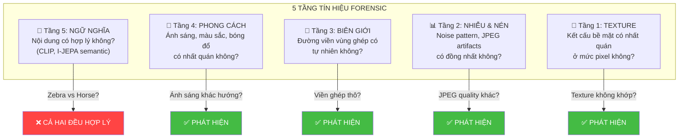
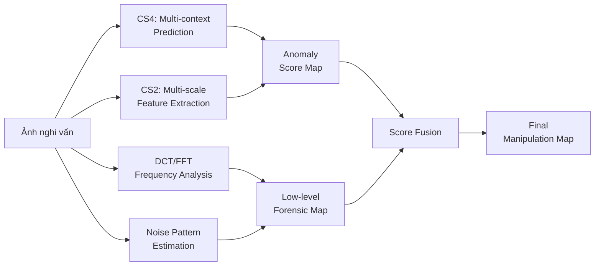

# Phân tích: Tại sao Detection thuần ngữ nghĩa thất bại và cách khắc phục

## Vấn đề cốt lõi

```
Ảnh gốc:     Ngựa vằn (zebra) trên đồng cỏ  → "Zebra on grass" ✅ hợp lý
Ảnh chỉnh sửa: Ngựa nâu (horse) trên đồng cỏ → "Horse on grass" ✅ CŨNG hợp lý!
```

**→ Mọi phương pháp dựa trên ngữ nghĩa (semantic) đều thất bại**, vì cả hai đều hợp lý về mặt nội dung.

## 5 tầng tín hiệu forensic — Từ ngữ nghĩa đến vật lý

Nghiên cứu gần đây (MVSS-Net, ObjectFormer, CAT-Net, NoiseSniffer, ForensicFormer) cho thấy manipulation detection hiệu quả phải kết hợp **nhiều tầng tín hiệu**, không chỉ ngữ nghĩa:



### Ví dụ cụ thể: Zebra → Horse

| Tầng | Kiểm tra gì? | Có phát hiện được không? | Tại sao? |
|:---|:---|:---|:---|
| 5. Ngữ nghĩa | "Horse on grass" hợp lý? | ❌ Không | Cả hai đều hợp lý |
| 4. Ánh sáng | Bóng đổ, hướng sáng nhất quán? | ✅ Có thể | Con ngựa ghép có thể có bóng sáng từ hướng khác |
| 3. Biên giới | Đường viền quanh con ngựa? | ✅ Có | Dù ghép khéo, biên vẫn có artifact nhỏ |
| 2. Nén JPEG | Quality factor đồng nhất? | ✅ Rất tốt | Vùng ghép thường bị nén khác (double compression) |
| 1. Texture | Noise + grain nhất quán? | ✅ Rất tốt | Camera noise, sensor pattern khác nhau |

> [!IMPORTANT]
> **Kết luận quan trọng**: Đối với trường hợp "ngữ nghĩa hợp lý" (zebra→horse), các tầng **2, 3, 4** mới là tín hiệu chính. Tầng 5 (ngữ nghĩa) chỉ hữu ích khi vật thể ghép *phi logic* (ví dụ: ghép cá mập lên đồng cỏ).

---

## Kết hợp 4 Chiến lược: Phủ đủ 5 tầng Forensic

### Ánh xạ Chiến lược → Tầng Forensic

| Chiến lược | Tầng chính | Tầng phụ | Cốt lõi |
|:---|:---|:---|:---|
| **CS1**: CLIP Multimodal | Tầng 5 (Ngữ nghĩa) | — | Phát hiện vật thể phi logic |
| **CS2**: Hierarchical Multi-scale | Tầng 1, 3, 4 | Tầng 2 | Phát hiện bất nhất texture, biên giới, ánh sáng ở nhiều scale |
| **CS3**: Memory-based | Tầng 4, 5 | Tầng 1 | So sánh với mẫu đã biết → phát hiện khác biệt phong cách |
| **CS4**: Multi-context Consistency | Tầng 3, 4 | Tầng 1, 2 | Dự đoán từ nhiều hướng → phát hiện mâu thuẫn |

### Chiến lược kết hợp tối ưu



---

## Đề xuất triển khai thực tế: Chiến lược 4 + Forensic Features

Trước khi implement phức tạp, ta có thể bắt đầu với phương pháp **hiệu quả nhất và đơn giản nhất**:

### Phương pháp A: I-JEPA Multi-context + High-frequency Analysis (Không cần train thêm)

```python
def detect_manipulation_combined(image, encoder, predictor):
    """
    Kết hợp CS4 (multi-context prediction) + tầng forensic thấp.
    Không cần CLIP, không cần train thêm.
    """
    # === TẦNG CAO: CS4 — Multi-context Prediction ===
    # Dự đoán mỗi vùng từ nhiều context → đo inconsistency
    semantic_map = multi_context_prediction(image, encoder, predictor)
    
    # === TẦNG THẤP: High-frequency forensic ===
    # Phân tích tần số cao (DCT) → phát hiện JPEG artifacts 
    dct_map = detect_jpeg_artifacts(image)
    
    # Phân tích noise pattern → phát hiện vùng có noise khác
    noise_map = detect_noise_inconsistency(image)
    
    # Phân tích biên → phát hiện edge artifacts
    edge_map = detect_boundary_artifacts(image)
    
    # === FUSION: Kết hợp tất cả ===
    # Weighted sum — tùy chỉnh trọng số theo loại manipulation
    final_map = (
        0.3 * normalize(semantic_map) +   # Tầng ngữ nghĩa
        0.3 * normalize(dct_map) +         # Tầng nén
        0.2 * normalize(noise_map) +       # Tầng nhiễu
        0.2 * normalize(edge_map)          # Tầng biên giới
    )
    return final_map


def detect_noise_inconsistency(image):
    """
    Lấy cảm hứng từ MVSS-Net Noise-Sensitive Branch.
    Ước lượng noise pattern → vùng có noise khác biệt = nghi vấn.
    """
    import cv2
    img_np = np.array(image)
    
    # High-pass filter để tách noise
    blur = cv2.GaussianBlur(img_np, (5, 5), 0)
    noise = img_np.astype(float) - blur.astype(float)
    
    # Tính local noise variance (sliding window)
    noise_var = local_variance(noise, window=32)
    
    # Vùng có noise variance khác biệt với xung quanh = nghi vấn
    global_var = noise_var.mean()
    anomaly = np.abs(noise_var - global_var) / (global_var + 1e-8)
    return anomaly


def detect_jpeg_artifacts(image):
    """
    Lấy cảm hứng từ CAT-Net DCT stream.
    Phân tích blocking artifacts từ JPEG compression.
    """
    import cv2
    gray = cv2.cvtColor(np.array(image), cv2.COLOR_RGB2GRAY).astype(float)
    
    # JPEG dùng block 8x8 → kiểm tra discontinuity tại biên block
    h, w = gray.shape
    block_diff = np.zeros_like(gray)
    
    # Horizontal block boundaries
    for i in range(8, h, 8):
        block_diff[i, :] = np.abs(gray[i, :] - gray[i-1, :])
    # Vertical block boundaries
    for j in range(8, w, 8):
        block_diff[:, j] = np.abs(gray[:, j] - gray[:, j-1])
    
    # Local mean of blocking artifacts
    kernel = np.ones((16, 16)) / 256
    artifact_map = cv2.filter2D(block_diff, -1, kernel)
    
    # Vùng có blocking artifacts khác biệt = double compressed = nghi vấn
    global_mean = artifact_map.mean()
    anomaly = np.abs(artifact_map - global_mean) / (global_mean + 1e-8)
    return anomaly
```

### Phương pháp B: Fine-tune I-JEPA Encoder cho Forensic Features (Cần train)

> Ý tưởng: Encoder hiện tại chỉ học semantic features. Nếu fine-tune trên ảnh có/không có manipulation, Encoder sẽ học thêm forensic features ở các layer sâu.

Đây chính là điểm mạnh của **Chiến lược 2 (Hierarchical)**:
- **Layer nông** của ViT → texture, noise, low-level features
- **Layer sâu** của ViT → semantic features
- Dùng **multi-scale features** (từ nhiều layer) thay vì chỉ output cuối

```python
class MultiScaleEncoder(nn.Module):
    """
    Trích xuất features từ nhiều layer của ViT Encoder.
    Layer nông: forensic (texture, noise, edges)
    Layer sâu: semantic (objects, scenes)
    """
    def __init__(self, encoder, layers=[3, 6, 9, 12]):
        super().__init__()
        self.encoder = encoder
        self.layers = layers
    
    def forward(self, x):
        features = []
        for i, blk in enumerate(self.encoder.blocks):
            x = blk(x)
            if i + 1 in self.layers:
                features.append(F.layer_norm(x, (x.size(-1),)))
        return features  # [shallow→deep] = [forensic→semantic]
```

---

## Trả lời câu hỏi ban đầu

> **Q: Nếu ảnh gốc là ngựa vằn, ảnh sửa là ngựa nâu — về ngữ nghĩa đều hợp lý, có cách nào phân biệt?**

**Có**, nhưng **KHÔNG phải bằng ngữ nghĩa**. Cần dùng tín hiệu forensic ở tầng thấp hơn:

| Tín hiệu | Giải thích | Công cụ |
|:---|:---|:---|
| **Noise mismatch** | Con ngựa ghép đến từ ảnh khác → noise pattern (grain, ISO) khác | Noise variance analysis |
| **JPEG double compression** | Vùng ghép bị nén 2 lần → blocking artifacts khác | DCT coefficient analysis |
| **Boundary artifacts** | Dù blend khéo, biên giới vùng ghép vẫn có micro-artifacts | Edge detection + local contrast |
| **Lighting direction** | Nếu ánh sáng chiếu từ hướng khác → bóng đổ không khớp | CS4 multi-context prediction |
| **Color/white balance** | Camera khác → white balance khác → color distribution lệch | Color histogram analysis |

## Khuyến nghị

1. **Bắt đầu đơn giản**: Thử **CS4 (Multi-context)** + **Noise/JPEG analysis** trước — không cần train, chạy zero-shot
2. **Nếu muốn train**: Fine-tune I-JEPA Encoder với multi-scale feature extraction (**CS2**) trên tập ảnh có manipulation
3. **Long-term**: Kết hợp cả 4 chiến lược + forensic features → hệ thống detection toàn diện

---

## Benchmark Datasets cho Image Manipulation Detection

### Tổng quan các bộ dataset chuẩn

| Dataset | Loại manipulation | Số ảnh | Có pixel-level mask? | Khuyên dùng | Download |
|:---|:---|:---|:---|:---|:---|
| **CASIA 2.0** | Splicing + Copy-move | 5,123 tampered + 7,491 authentic | ✅ Có (đã được sửa lỗi 2024) | ⭐⭐⭐ **Nên dùng đầu tiên** | [Kaggle](https://www.kaggle.com/datasets/divg07/casia-20-image-tampering-detection-dataset), [GitHub corrected GT](https://github.com/namtpham/IML-Dataset-Corrections) |
| **Columbia** | Splicing | 180 spliced + 183 authentic | ✅ Có | ⭐⭐ Nhỏ, dùng test nhanh | [Columbia DVMM](https://www.ee.columbia.edu/ln/dvmm/downloads/) |
| **COVERAGE** | Copy-move | 100 cặp original-forged | ✅ Có | ⭐⭐ Chuyên copy-move | [GitHub](https://github.com/wenbihan/coverage) |
| **IMD2020** | GAN + Inpainting + Splicing | 35,000 synthetic + 2,000 real-life | ✅ Có (real-life subset) | ⭐⭐⭐ **Lớn và đa dạng** | [IEEE DataPort](https://ieee-dataport.org/documents/imd2020) |
| **NIST MFC** | Splicing + Copy-move + Enhancement | Hàng ngàn (nhiều challenge) | ✅ Có | ⭐⭐⭐ Chuẩn công nghiệp | [NIST MFC](https://mfc.nist.gov) |
| **DEFACTO** | Copy-move + Splicing + Removal + Morphing | Tự động sinh | ✅ Có (binary masks) | ⭐⭐ Diversity cao | [GitHub](https://defactodataset.github.io/) |
| **CoMoFoD** | Copy-move (rotation, scaling) | 260 forged | ✅ Có | ⭐⭐ Chuyên copy-move nâng cao | [SourceForge](https://sourceforge.net/projects/comofod/) |
| **CIMD (2024)** | Small tampered regions + compression | Nhiều subsets | ✅ Có | ⭐⭐ Benchmark mới, challenging | [arXiv:2311.12555](https://arxiv.org/abs/2311.12555) |

### Khuyến nghị chọn dataset

> [!TIP]
> **Bắt đầu với CASIA 2.0** — đây là dataset phổ biến nhất, được trích dẫn trong hầu hết các paper SOTA (MVSS-Net, ObjectFormer, CAT-Net). Ground truth masks đã được cộng đồng sửa lỗi vào 03/2024. Kích thước vừa phải, dễ tải, có cả splicing và copy-move.

> [!IMPORTANT]
> **Lưu ý về CASIA 2.0**: Ground truth masks gốc có lỗi (rotation, resolution mismatch). **Phải dùng phiên bản corrected** từ [IML-Dataset-Corrections](https://github.com/namtpham/IML-Dataset-Corrections).

#### Cấu trúc CASIA 2.0

```
CASIA2/
├── Au/          # Authentic images (7,491 ảnh)
│   ├── Au_ani_00001.jpg
│   ├── Au_arc_00001.jpg
│   └── ...
├── Tp/          # Tampered images (5,123 ảnh)
│   ├── Tp_D_CND_M_N_ani00018_sec00096_00138.tif   # Copy-move
│   ├── Tp_S_NRN_S_N_ani10120_ani10090_10839.tif   # Splicing
│   └── ...
└── GT/          # Ground truth masks (corrected version)
    ├── Tp_D_CND_M_N_ani00018_sec00096_00138_gt.png
    ├── Tp_S_NRN_S_N_ani10120_ani10090_10839_gt.png
    └── ...
```

**Tên file encoding**: `Tp_[S/D]_[method]_[postprocess]_[source]_[target]_[id]`
- `S` = Splicing, `D` = Copy-move (Duplication)
- `method`: CND (Copy-aNd-paste), NRN (No-Reference-Normalize), etc.

---

## Chiến lược Testing — Evaluation Protocol

### Metrics chuẩn

| Metric | Mục đích | Công thức / Ý nghĩa | Cách dùng |
|:---|:---|:---|:---|
| **Pixel-level F1** | Đo chất lượng localization | 2·Precision·Recall / (Precision+Recall) | Metric chính, threshold-dependent |
| **Pixel-level AUC** | Đo khả năng phân biệt tổng thể | Area under ROC curve | Threshold-independent, dùng so sánh models |
| **IoU** | Đo overlap giữa prediction và GT | Intersection / Union | Trực quan, thường dùng threshold 0.5 |
| **Image-level AUC** | Phát hiện ảnh có bị sửa hay không | Binary classification AUC | Bổ sung, không đo localization |

### Protocol Testing chi tiết

```python
"""
Evaluation Protocol cho Image Manipulation Detection
Dùng cho tất cả các chiến lược (CS1-CS4 + Forensic)
"""
import numpy as np
from sklearn.metrics import roc_auc_score, f1_score, precision_recall_curve
from PIL import Image
import os
import glob


class ManipulationDetectionEvaluator:
    """
    Đánh giá chất lượng phát hiện chỉnh sửa ảnh.
    
    Workflow:
    1. Load dataset (CASIA 2.0 hoặc dataset khác)
    2. Chạy detector trên từng ảnh → anomaly map
    3. So sánh anomaly map vs ground truth mask
    4. Tính metrics: F1, AUC, IoU
    """
    
    def __init__(self, dataset_dir, gt_dir):
        """
        Args:
            dataset_dir: thư mục chứa ảnh tampered (Tp/)
            gt_dir: thư mục chứa ground truth masks (GT/)
        """
        self.dataset_dir = dataset_dir
        self.gt_dir = gt_dir
        self.image_paths = sorted(glob.glob(os.path.join(dataset_dir, '*')))
        print(f"Found {len(self.image_paths)} tampered images")
    
    def _load_gt_mask(self, image_path):
        """Load ground truth mask tương ứng với ảnh."""
        basename = os.path.splitext(os.path.basename(image_path))[0]
        # CASIA 2.0 naming convention
        gt_path = os.path.join(self.gt_dir, basename + '_gt.png')
        if not os.path.exists(gt_path):
            gt_path = os.path.join(self.gt_dir, basename + '.png')
        if not os.path.exists(gt_path):
            return None
        
        gt = np.array(Image.open(gt_path).convert('L'))
        gt = (gt > 128).astype(np.float32)  # Binary mask
        return gt
    
    def evaluate(self, detector_fn, num_samples=None):
        """
        Chạy evaluation trên toàn bộ dataset.
        
        Args:
            detector_fn: function(image_path) → anomaly_map [H, W] 
                         giá trị cao = nghi vấn bị sửa
            num_samples: giới hạn số ảnh test (None = tất cả)
        
        Returns:
            dict với các metrics
        """
        all_pixel_preds = []
        all_pixel_gts = []
        all_image_preds = []  # Image-level scores
        all_image_gts = []
        
        paths = self.image_paths[:num_samples] if num_samples else self.image_paths
        
        for i, img_path in enumerate(paths):
            # 1. Load ground truth
            gt_mask = self._load_gt_mask(img_path)
            if gt_mask is None:
                continue
            
            # 2. Chạy detector → anomaly map
            anomaly_map = detector_fn(img_path)
            
            # 3. Resize anomaly map cho khớp GT size
            from scipy.ndimage import zoom
            if anomaly_map.shape != gt_mask.shape:
                scale_h = gt_mask.shape[0] / anomaly_map.shape[0]
                scale_w = gt_mask.shape[1] / anomaly_map.shape[1]
                anomaly_map = zoom(anomaly_map, (scale_h, scale_w), order=1)
            
            # 4. Normalize anomaly map về [0, 1]
            if anomaly_map.max() > anomaly_map.min():
                anomaly_map = (anomaly_map - anomaly_map.min()) / \
                              (anomaly_map.max() - anomaly_map.min())
            
            # 5. Thu thập predictions
            all_pixel_preds.append(anomaly_map.flatten())
            all_pixel_gts.append(gt_mask.flatten())
            
            # Image-level: max anomaly score
            all_image_preds.append(anomaly_map.max())
            all_image_gts.append(1.0)  # Tampered image
            
            if (i + 1) % 50 == 0:
                print(f"Processed {i+1}/{len(paths)} images")
        
        # 6. Tính metrics
        pixel_preds = np.concatenate(all_pixel_preds)
        pixel_gts = np.concatenate(all_pixel_gts)
        
        results = {}
        
        # Pixel-level AUC
        results['pixel_auc'] = roc_auc_score(pixel_gts, pixel_preds)
        
        # Pixel-level F1 (tìm threshold tối ưu)
        precisions, recalls, thresholds = precision_recall_curve(
            pixel_gts, pixel_preds
        )
        f1_scores = 2 * precisions * recalls / (precisions + recalls + 1e-8)
        best_idx = np.argmax(f1_scores)
        results['pixel_f1'] = f1_scores[best_idx]
        results['best_threshold'] = thresholds[best_idx] if best_idx < len(thresholds) else 0.5
        
        # Pixel-level IoU (tại threshold tối ưu)
        binary_pred = (pixel_preds >= results['best_threshold']).astype(float)
        intersection = (binary_pred * pixel_gts).sum()
        union = ((binary_pred + pixel_gts) > 0).sum()
        results['pixel_iou'] = intersection / (union + 1e-8)
        
        # Fixed-threshold F1 (threshold = 0.5)
        binary_pred_05 = (pixel_preds >= 0.5).astype(float)
        results['pixel_f1_fixed'] = f1_score(pixel_gts, binary_pred_05)
        
        return results
    
    def print_results(self, results):
        """In kết quả đánh giá."""
        print("\n" + "=" * 50)
        print("EVALUATION RESULTS")
        print("=" * 50)
        print(f"  Pixel-level AUC:      {results['pixel_auc']:.4f}")
        print(f"  Pixel-level F1 (opt): {results['pixel_f1']:.4f}")
        print(f"  Pixel-level F1 (0.5): {results['pixel_f1_fixed']:.4f}")
        print(f"  Pixel-level IoU:      {results['pixel_iou']:.4f}")
        print(f"  Best threshold:       {results['best_threshold']:.4f}")
        print("=" * 50)


# ============================================================
# CÁCH SỬ DỤNG
# ============================================================

# Bước 1: Tải CASIA 2.0 + corrected GT
# wget hoặc tải từ Kaggle/GitHub

# Bước 2: Định nghĩa detector function
def my_detector(image_path):
    """
    Thay thế bằng detector thực tế.
    Trả về anomaly_map [H, W] — giá trị cao = nghi vấn.
    """
    # Ví dụ: CS4 Multi-context prediction
    # anomaly_map = multi_context_prediction(image_path)
    
    # Ví dụ: Noise inconsistency detection
    # anomaly_map = detect_noise_inconsistency(Image.open(image_path))
    
    # Ví dụ: Kết hợp
    # anomaly_map = detect_manipulation_combined(image_path)
    
    pass  # Thay bằng implementation thực tế

# Bước 3: Chạy evaluation
# evaluator = ManipulationDetectionEvaluator(
#     dataset_dir='/path/to/CASIA2/Tp',
#     gt_dir='/path/to/CASIA2/GT'
# )
# results = evaluator.evaluate(my_detector, num_samples=100)
# evaluator.print_results(results)
```

### Kế hoạch Testing theo từng chiến lược

| Giai đoạn | Chiến lược | Dataset | Metric chính | Mục tiêu |
|:---|:---|:---|:---|:---|
| **Phase 1** | CS4: Multi-context (zero-shot) | CASIA 2.0 (100 ảnh) | Pixel AUC, F1 | Baseline — xác nhận ý tưởng có hoạt động |
| **Phase 2** | CS4 + Noise/JPEG forensic | CASIA 2.0 (full) | Pixel AUC, F1, IoU | Kiểm tra fusion tầng cao + thấp |
| **Phase 3** | CS2: Multi-scale features | CASIA 2.0 + Columbia | Pixel F1, IoU | So sánh multi-scale vs single-scale |
| **Phase 4** | Combined (CS2+CS4+Forensic) | CASIA 2.0 + IMD2020 | Tất cả metrics | Cross-dataset generalization |

### So sánh với SOTA baselines

Để biết chiến lược có tốt không, so sánh với kết quả SOTA trên CASIA 2.0:

| Phương pháp | Pixel F1 | Pixel AUC | Ghi chú |
|:---|:---|:---|:---|
| MVSS-Net (2021) | 0.587 | 0.778 | Multi-view + edge + noise |
| ObjectFormer (2022) | 0.579 | 0.817 | RGB + frequency, object-level |
| CAT-Net v2 (2022) | — | 0.832 | DCT + RGB, JPEG-aware |
| **Mục tiêu của chúng ta** | **≥ 0.5** | **≥ 0.75** | Nếu đạt → chiến lược khả thi |

> [!NOTE]
> Các SOTA trên đều được **train supervised** trên dữ liệu manipulation. Chiến lược của chúng ta là **zero-shot** (không train trên manipulation data), nên mục tiêu thấp hơn là hợp lý. Nếu đạt F1 ≥ 0.5 và AUC ≥ 0.75 ở dạng zero-shot thì đã rất tốt.
